# แผนปฏิบัติการและ Roadmap การแก้ไขตาม CODE_AUDIT.md

> **วันบันทึกแผน**: 18 กันยายน 2026  
> **เงื่อนไขสำคัญ**:
> 1. **แยก Branch ชัดเจน**: โค้ดฝั่ง Frontend ให้ทำใน `fix/frontend` และฝั่ง Backend ให้ทำใน `fix/backend`
> 2. **Commit ทุกหัวข้อย่อย**: เมื่อทำแต่ละข้อย่อยเสร็จให้ `git commit` ทันที และเมื่อเสร็จสิ้นทั้งหมดให้ commit ปิดท้าย
> 3. ⚠️ **ห้าม PUSH (`ห้าม git push`)**: ทุกขั้นตอนให้ทำเฉพาะ local เท่านั้น

---

## 📌 สรุปสถานะล่าสุด (Baseline: Commit `1c9c1fc`)

- **ข้อที่แก้ไขเสร็จแล้วใน `1c9c1fc`**:
  - ✅ **1.1** `updateQty` race condition (`CartContext.jsx`)
  - ✅ **2.1** `AuthContext` storage unguarded writes (`AuthContext.jsx`)
  - ✅ **4.2** นำ migration scripts (`addEnglishDescriptions.mjs`, `fixProductColors.mjs`) เข้า Git tracking
- **ข้อที่ยังค้างอยู่และต้องดำเนินการต่อ**:
  - ฝั่ง Backend: **1.2 (Backend part)**, **2.2**, **2.3**, **2.4**, **2.5**
  - ฝั่ง Frontend: **1.2 (Frontend part)**, **1.3**, **3.1**, **4.1**, **4.4**, **4.5**

---

## 🌲 กลยุทธ์การแยก Git Branch

```mermaid
graph TD
    Base["design/product-modal (Commit 1c9c1fc)"] --> BranchBE["Branch: fix/backend"]
    Base --> BranchFE["Branch: fix/frontend"]
    
    subgraph "Backend Tasks (fix/backend)"
        BE1["Task B1: 1.2 ล้าง Server Cart & DELETE /api/cart"]
        BE2["Task B2: 2.3 ซ่อน Raw Error ใน auth.js"]
        BE3["Task B3: 2.4 จำกัด CORS Allow-list"]
        BE4["Task B4: 2.5 เพิ่ม Rate Limit บน /api/orders"]
        BE5["Task B5: 2.2 ปรับ userId ใน Cart & Orders"]
        BE1 --> BE2 --> BE3 --> BE4 --> BE5
    end
    
    subgraph "Frontend Tasks (fix/frontend)"
        FE1["Task F1: 1.2 เชื่อม clearCart กับ API"]
        FE2["Task F2: 1.3 รวม getCartKey และ parsePrice"]
        FE3["Task F3: 3.1 ครอบ try/catch ใน AdminPage storage"]
        FE4["Task F4: 4.1 ปรับ ErrorBoundary remount"]
        FE5["Task F5: 4.4 & 4.5 แก้ชื่อ SHIPPING_OPTIONS & ลบ Navigate"]
        FE1 --> FE2 --> FE3 --> FE4 --> FE5
    end
```



---

## 🛠️ รายละเอียดงานฝั่ง BACKEND (`fix/backend`)

คำสั่งเริ่มต้น:
```bash
git checkout design/product-modal
git checkout -b fix/backend
```

### [Task B1] ล้างตะกร้าฝั่ง Server เมื่อสั่งซื้อสำเร็จ + เพิ่ม Endpoint ล้างตะกร้า (ข้อ 1.2)
- **ไฟล์เป้าหมาย**:
  - `backend/routes/cartRoutes.js`
  - `backend/routes/orderRoutes.js`
- **สิ่งที่ต้องทำ**:
  1. ใน `cartRoutes.js`: เพิ่ม route `DELETE /api/cart` (สำหรับเคลียร์สินค้าทั้งหมดในตะกร้าของเจ้าของ `req.cartOwner`):
     ```javascript
     // DELETE /api/cart — ล้างสินค้าทั้งหมดออกจากตะกร้า
     router.delete('/', requireOwner, async (req, res) => {
       if (!dbReady()) return emptyCart(res);
       try {
         const cart = await findOrCreateCart(req.cartOwner);
         cart.items = [];
         await cart.save();
         res.json({ success: true, data: { items: [] }, message: 'ล้างตะกร้าเรียบร้อยแล้ว' });
       } catch (err) {
         console.error('Error clearing cart:', err);
         res.status(500).json({ success: false, message: 'ล้างตะกร้าไม่สำเร็จ' });
       }
     });
     ```
  2. ใน `orderRoutes.js`: หลังบันทึกออเดอร์ (`savedOrder = await orderDoc.save();`) ให้สั่งล้างตะกร้าของลูกค้ารายนั้นใน MongoDB ทันที:
     ```javascript
     // ล้างตะกร้าฝั่งเซิร์ฟเวอร์ทันทีที่ออเดอร์ถูกบันทึกสำเร็จ
     try {
       const guestId = String(req.headers['x-guest-id'] || '').trim();
       const cartQuery = orderUserId ? { userId: orderUserId } : (guestId ? { guestId } : null);
       if (cartQuery && mongoose.connection.readyState === 1) {
         await Cart.findOneAndUpdate(cartQuery, { $set: { items: [] } });
       }
     } catch (cartErr) {
       console.warn('Could not auto-clear server cart after order:', cartErr.message);
     }
     ```
- **คำสั่ง Commit**:
  ```bash
  git add backend/routes/cartRoutes.js backend/routes/orderRoutes.js
  git commit -m "fix(backend-cart): clear server-side cart on order completion and expose DELETE /api/cart"
  ```

---

### [Task B2] ซ่อน Raw Error Messages ใน Auth Endpoints (ข้อ 2.3)
- **ไฟล์เป้าหมาย**: `backend/routes/auth.js` (บรรทัด 81 และ 107)
- **สิ่งที่ต้องทำ**:
  - แทนที่ `res.status(500).json({ success: false, message: err.message });`
  - ด้วยการ `console.error('[Auth Error]', err);` ฝั่ง Server และส่งข้อความที่ปลอดภัยให้ Client:
    ```javascript
    res.status(500).json({ success: false, message: 'การยืนยันตัวตนขัดข้อง กรุณาลองใหม่อีกครั้ง' });
    ```
- **คำสั่ง Commit**:
  ```bash
  git add backend/routes/auth.js
  git commit -m "fix(backend-auth): sanitize error messages on register and login endpoints"
  ```

---

### [Task B3] จำกัด CORS Allow-list ให้ปลอดภัย (ข้อ 2.4)
- **ไฟล์เป้าหมาย**: `backend/server.js` (บรรทัด 37)
- **สิ่งที่ต้องทำ**:
  - เปลี่ยนจาก `cors({ origin: true, credentials: true })`
  - กำหนด Whitelist โดเมนที่อนุญาต (เช่น `http://localhost:5173`, `http://localhost:3000`, และ `process.env.FRONTEND_URL`):
    ```javascript
    const allowedOrigins = [
      process.env.FRONTEND_URL,
      'http://localhost:5173',
      'http://localhost:3000',
      'http://127.0.0.1:5173'
    ].filter(Boolean);

    app.use(cors({
      origin: (origin, callback) => {
        if (!origin || allowedOrigins.includes(origin)) {
          callback(null, true);
        } else {
          callback(new Error('CORS not allowed for this origin'));
        }
      },
      credentials: true
    }));
    ```
- **คำสั่ง Commit**:
  ```bash
  git add backend/server.js
  git commit -m "fix(backend-cors): restrict cross-origin access to configured allow-list"
  ```

---

### [Task B4] เพิ่ม Rate Limiter สำหรับ `/api/orders` (ข้อ 2.5)
- **ไฟล์เป้าหมาย**: `backend/routes/orderRoutes.js`
- **สิ่งที่ต้องทำ**:
  - นำเข้า `rateLimit` จาก `express-rate-limit`
  - สร้าง middleware ป้องกันการ spam ยิงสร้างคำสั่งซื้อ (เช่น 20 ออเดอร์ต่อ 15 นาที ต่อ 1 IP)
- **คำสั่ง Commit**:
  ```bash
  git add backend/routes/orderRoutes.js
  git commit -m "fix(backend-orders): add rate limiting protection to order creation endpoint"
  ```

---

### [Task B5] ปรับ User Identity ให้สอดคล้องกัน (ข้อ 2.2)
- **ไฟล์เป้าหมาย**:
  - `backend/models/Cart.js`
  - `backend/routes/cartRoutes.js`
  - `backend/routes/orderRoutes.js` (บรรทัด 152-155)
- **สิ่งที่ต้องทำ**:
  - รวม commit `8ffa880` จาก branch `backend/cart-identity` (เปลี่ยน `Cart.userId` เป็น `String` และแก้ guard `resolveOwner`)
  - ใน `orderRoutes.js` แก้การตรวจ `candidateId`:
    ```javascript
    // รองรับทั้ง String ID จาก userStore (u_...) และ Mongo ObjectId
    let orderUserId = null;
    const candidateId = authUser?.id || authUser?.userId || authUser?._id;
    if (candidateId && String(candidateId).trim()) {
      orderUserId = String(candidateId).trim();
    }
    ```
- **คำสั่ง Commit**:
  ```bash
  git add backend/models/Cart.js backend/routes/cartRoutes.js backend/routes/orderRoutes.js
  git commit -m "fix(backend-auth): support string user identity in cart and order records"
  ```

---

## 💻 รายละเอียดงานฝั่ง FRONTEND (`fix/frontend`)

คำสั่งเริ่มต้น:
```bash
git checkout design/product-modal
git checkout -b fix/frontend
```

### [Task F1] เชื่อม `clearCart` กับ Backend API และรีเซ็ต `cartItemsRef` (ข้อ 1.2)
- **ไฟล์เป้าหมาย**:
  - `frontend/src/services/api.js`
  - `frontend/src/context/CartContext.jsx`
- **สิ่งที่ต้องทำ**:
  1. ใน `api.js`: เพิ่มฟังก์ชัน `clearCart`:
     ```javascript
     clearCart: async () => {
       return fetchWithFallback('/cart', { method: 'DELETE' });
     },
     ```
  2. ใน `CartContext.jsx`:
     - ปรับปรุงฟังก์ชัน `clearCart`:
       ```javascript
       const clearCart = useCallback(() => {
         cartItemsRef.current = [];
         setCartItems([]);
         api.clearCart().catch((err) => {
           console.warn('Backend cart clear note:', err.message);
         });
       }, []);
       ```
- **คำสั่ง Commit**:
  ```bash
  git add frontend/src/services/api.js frontend/src/context/CartContext.jsx
  git commit -m "fix(frontend-cart): synchronize clearCart with backend API and clear item ref"
  ```

---

### [Task F2] รวม `getCartKey` และ `parsePrice` เป็นจุดเดียว (ข้อ 1.3)
- **ไฟล์เป้าหมาย**: `frontend/src/pages/CartPage.jsx`
- **สิ่งที่ต้องทำ**:
  - ลบฟังก์ชันประกาศซ้ำ:
    - ลบ `const parsePrice = ...` (บรรทัด 9) -> ให้ import จาก `CartContext.jsx` หรือย้าย helper กลาง
    - ลบ `const getCartKey = ...` (บรรทัด 10) -> ให้ import `{ getCartKey } from '../context/CartContext.jsx'`
- **คำสั่ง Commit**:
  ```bash
  git add frontend/src/pages/CartPage.jsx
  git commit -m "fix(frontend-cart): import canonical getCartKey and deduplicate price parser"
  ```

---

### [Task F3] ครอบ `try/catch` การเขียน `localStorage` ใน `AdminPage.jsx` (ข้อ 3.1)
- **ไฟล์เป้าหมาย**: `frontend/src/pages/AdminPage.jsx` (บรรทัด 324-335)
- **สิ่งที่ต้องทำ**:
  - ครอบ `try/catch` ใน `useEffect` ทั้ง 3 จุด (inventory, orders, members) เพื่อป้องกันกรณี Safari Private Mode หรือ Storage Full
- **คำสั่ง Commit**:
  ```bash
  git add frontend/src/pages/AdminPage.jsx
  git commit -m "fix(frontend-admin): guard localStorage writes against quota and private mode exceptions"
  ```

---

### [Task F4] ป้องกัน `ErrorBoundary` รีเมาท์ทั้งหน้าจอโดยไม่จำเป็น (ข้อ 4.1)
- **ไฟล์เป้าหมาย**: `frontend/src/App.jsx` (บรรทัด 272)
- **สิ่งที่ต้องทำ**:
  - เปลี่ยนจากการใช้ `key={location.pathname}` ที่ล้าง Subtree ทุกการเปลี่ยนหน้า
  - ใช้ `resetKeys={[location.pathname]}` หรือจำกัดขอบเขต key เพื่อรักษา Form state และ Scroll position
- **คำสั่ง Commit**:
  ```bash
  git add frontend/src/App.jsx
  git commit -m "fix(frontend-app): prevent tree destruction on route change in ErrorBoundary"
  ```

---

### [Task F5] แก้ไขตัวแปร `SHIPPING_OPTIONS` ซ้อนทับ และลบ Unused Import (ข้อ 4.4, 4.5)
- **ไฟล์เป้าหมาย**:
  - `frontend/src/pages/PaymentPage.jsx`
  - `frontend/src/App.jsx`
- **สิ่งที่ต้องทำ**:
  1. ใน `PaymentPage.jsx`: เปลี่ยนชื่อ `const SHIPPING_OPTIONS = [...]` เป็น `const SHIPPING_METHOD_ITEMS = [...]` เพื่อไม่ให้ชื่อชนกับ `import { SHIPPING_OPTIONS as SHIPPING_RATES }`
  2. ใน `App.jsx`: ลบ `Navigate` ออกจาก `import { Routes, Route, useNavigate, useLocation, Navigate } from 'react-router-dom';`
- **คำสั่ง Commit**:
  ```bash
  git add frontend/src/pages/PaymentPage.jsx frontend/src/App.jsx
  git commit -m "fix(frontend-polish): resolve shipping options name collision and drop unused Navigate import"
  ```

---

## 🏁 ขั้นตอนปิดท้ายเมื่อทำเสร็จทั้งหมด
1. รัน `npm run build` หรือเทสการทำงานของระบบ
2. ตรวจสอบสถานะ `git status` ในแต่ละ branch
3. ทำ commit สรุปสุดท้าย (ถ้ามี)
4. 🛑 **ย้ำอีกครั้ง: ห้ามรัน `git push`** ตามที่คุณสั่งไว้ครับ
