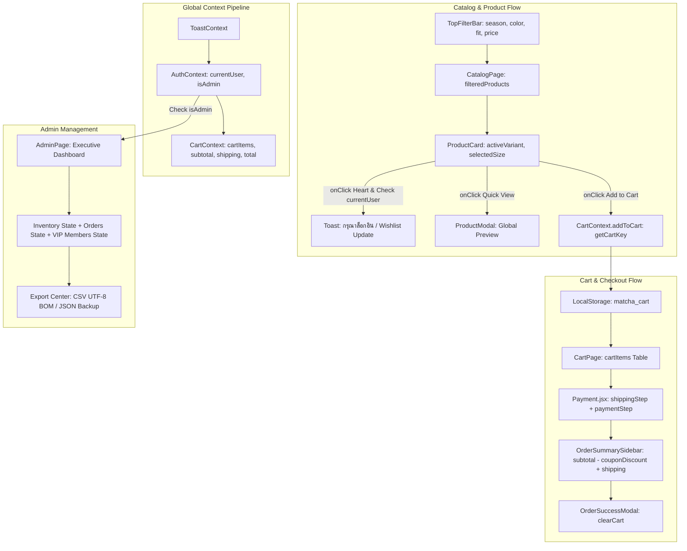

# MatchA Full-Stack Codebase Master Blueprint (Alldata.md)

> **คู่มือรหัสโค้ด, ตารางตัวแปร, State, Props, Data Flow & Variable Traceability ฉบับสมบูรณ์**  
> สถาปัตยกรรม: React 18 (Vite) · Tailwind CSS v4 · React Context API · Express.js · Lenis Smooth Scroll · Lucide Icons

---

## 📌 สารบัญ (Table of Contents)
1. [ภาพรวมสถาปัตยกรรม & แผนผัง Variable Data Flow](#1-ภาพรวมสถาปัตยกรรม--แผนผัง-variable-data-flow)
2. [Global Context Layer (State ส่วนกลางของทั้งระบบ)](#2-global-context-layer)
   - 2.1 [`CartContext.jsx`](#21-cartcontextjsx--ระบบจัดการตะกร้าสินค้าและคำนวณราคา) (ระบบตะกร้า, Compound Key & ราคารวม)
   - 2.2 [`AuthContext.jsx`](#22-authcontextjsx--ระบบจัดการสถานะผู้ใช้และสิทธิ์-rbac) (ระบบยืนยันตัวตน, บทบาท Admin/VIP & Session)
   - 2.3 [`ToastContext.jsx`](#23-toastcontextjsx--ระบบป๊อปอัปแจ้งเตือนส่วนกลาง) (ระบบป๊อปอัปแจ้งเตือนส่วนกลาง)
3. [Root & Global Routing (`App.jsx` & `Layout.jsx`)](#3-root--global-routing-appjsx--layoutjsx)
4. [หน้าแคตตาล็อกสินค้า & ตัวกรองแนวนอน (`CatalogPage.jsx` & `TopFilterBar.jsx`)](#4-หน้าแคตตาล็อกสินค้า--ตัวกรองแนวนอน)
5. [คอมโพเนนต์การ์ดสินค้า & หน้าต่างพรีวิว (`ProductCard.jsx` & `ProductModal.jsx`)](#5-คอมโพเนนต์การ์ดสินค้า--หน้าต่างพรีวิว)
6. [หน้าตะกร้าสินค้า & ตัววัดยอดส่งฟรี (`CartPage.jsx`)](#6-หน้าตะกร้าสินค้า--ตัววัดยอดส่งฟรี)
7. [ระบบชำระเงิน & คำนวณส่วนลด (`Payment.jsx` & Sub-Components)](#7-ระบบชำระเงิน--คำนวณส่วนลด)
8. [ระบบสมาชิก & โปรไฟล์ผู้ใช้ (`LoginPage.jsx` & `UserAccount.jsx`)](#8-ระบบสมาชิก--โปรไฟล์ผู้ใช้)
9. [หน้าผู้ดูแลระบบระดับสูง (`AdminPage.jsx` — Executive Command Dashboard)](#9-หน้าผู้ดูแลระบบระดับสูง-adminpagejsx)
10. [Service Layer & API Resilience (`api.js` & `productsData.js`)](#10-service-layer--api-resilience)

---

## 1. ภาพรวมสถาปัตยกรรม & แผนผัง Variable Data Flow



---

## 2. Global Context Layer

---

### 2.1 `CartContext.jsx` — ระบบจัดการตะกร้าสินค้าและคำนวณราคา

#### 💻 โค้ดหลัก (Source Code):
```javascript
import React, { createContext, useContext, useState, useEffect } from 'react';
import { useToast } from './ToastContext';

const CartContext = createContext(null);

export const CartProvider = ({ children }) => {
  const { showToast } = useToast();

  // ดึงตะกร้าเดิมจาก LocalStorage (Initial State)
  const [cartItems, setCartItems] = useState(() => {
    try {
      const saved = localStorage.getItem('matcha_cart');
      return saved ? JSON.parse(saved) : [];
    } catch {
      return [];
    }
  });

  // ซิงก์ลง LocalStorage ทุกครั้งที่ cartItems มีการเปลี่ยนแปลง
  useEffect(() => {
    try {
      localStorage.setItem('matcha_cart', JSON.stringify(cartItems));
    } catch (err) {
      console.error('Failed to persist cart:', err);
    }
  }, [cartItems]);

  // ฟังก์ชันสร้าง Compound Key: id-size-color
  const getCartKey = (item) => {
    const id = item?.id || 'unknown';
    const size = item?.size || 'M';
    const color = item?.color || 'Signature';
    return `${id}-${size}-${color}`;
  };

  // เพิ่มสินค้าลงตะกร้า
  const addToCart = (product, customQty = null) => {
    const qtyToAdd = customQty !== null ? Number(customQty) : (product?.quantity ? Number(product.quantity) : 1);
    
    setCartItems((prev) => {
      const targetKey = getCartKey(product);
      const existingIndex = prev.findIndex((item) => getCartKey(item) === targetKey);

      if (existingIndex > -1) {
        const updated = [...prev];
        updated[existingIndex] = {
          ...updated[existingIndex],
          quantity: updated[existingIndex].quantity + qtyToAdd
        };
        return updated;
      }

      return [...prev, { ...product, quantity: qtyToAdd }];
    });

    showToast(`Added "${product?.name || 'Garment'}" to bag!`, 'success');
  };

  // ปรับจำนวน (+1 / -1) และลบอัตโนมัติหากเหลือ 0
  const updateQty = (key, delta) => {
    setCartItems((prev) =>
      prev
        .map((item) => {
          if (getCartKey(item) === key) {
            return { ...item, quantity: item.quantity + delta };
          }
          return item;
        })
        .filter((item) => item.quantity > 0)
    );
  };

  // ลบสินค้า
  const removeItem = (key) => {
    setCartItems((prev) => prev.filter((item) => getCartKey(item) !== key));
    showToast('Item removed from bag', 'info');
  };

  // ล้างตะกร้า
  const clearCart = () => setCartItems([]);

  // ตัวแปรคำนวณราคา
  const cartCount = cartItems.reduce((sum, item) => sum + (item.quantity || 1), 0);
  const subtotal = cartItems.reduce((sum, item) => sum + (Number(item.price) || 0) * (item.quantity || 1), 0);
  const shipping = subtotal >= 100 || cartItems.length === 0 ? 0 : 10;
  const total = subtotal + shipping;
  const awayFromFreeShipping = Math.max(0, 100 - subtotal);

  return (
    <CartContext.Provider value={{
      cartItems, addToCart, updateQty, removeItem, clearCart,
      getCartKey, cartCount, subtotal, shipping, total, awayFromFreeShipping
    }}>
      {children}
    </CartContext.Provider>
  );
};

export const useCart = () => useContext(CartContext);
```

#### 📊 ตารางแจกแจงตัวแปร (Variable Traceability):
| ชื่อตัวแปร / ฟังก์ชัน | ชนิดข้อมูล | หน้าที่การทำงาน | ผลกระทบและการเชื่อมต่อ (Variable Connections) |
| :--- | :--- | :--- | :--- |
| `cartItems` | `Array<Object>` | เก็บรายการสินค้าทั้งหมดในตะกร้า | ส่งต่อให้ `Navbar` (แสดงตัวเลขนับ), `CartPage` (แสดงตาราง), และ `Payment` (สรุปยอด) |
| `getCartKey(item)` | `Function` | รวม `${id}-${size}-${color}` เป็น Unique Key | ป้องกันสินค้า SKU เดียวกันแต่คนละสี/ไซส์ ทับกันใน `addToCart` และ `updateQty` |
| `addToCart(prod, qty)`| `Function` | บวกจำนวนในรายการเดิม หรือต่อท้าย Array | อัปเดต `cartItems` $\to$ ซิงก์ `localStorage` $\to$ สั่งแสดง `Toast` แจ้งเตือน |
| `updateQty(key, delta)`| `Function` | บวก/ลบจำนวนสินค้าทีละ 1 | หาก `quantity + delta === 0` จะถูก `.filter()` ลบออกจาก `cartItems` ทันที |
| `cartCount` | `Number` | คำนวณจำนวนชิ้นรวม | ส่งให้ `Navbar.jsx` เพื่อเด้งแสดง Bubble Badge สีเขียวมัทฉะ |
| `subtotal` | `Number` | คำนวณราคาสินค้ารวม | ใช้กำหนดเงื่อนไขโปรโมชันส่งฟรี `shipping` ($100 ขึ้นไปส่งฟรี) |
| `awayFromFreeShipping`| `Number` | ยอดคงเหลือที่ต้องซื้อเพิ่ม | ส่งให้ `Free Shipping Progress Bar` บนหน้า `CartPage.jsx` |

---

### 2.2 `AuthContext.jsx` — ระบบจัดการสถานะผู้ใช้และสิทธิ์ RBAC

#### 💻 โค้ดหลัก (Source Code):
```javascript
import React, { createContext, useContext, useState, useEffect } from 'react';

const AuthContext = createContext(null);

export const AuthProvider = ({ children }) => {
  const [currentUser, setCurrentUser] = useState(() => {
    try {
      const local = localStorage.getItem('matcha_user');
      if (local) return JSON.parse(local);
      const session = sessionStorage.getItem('matcha_user');
      if (session) return JSON.parse(session);
      return null;
    } catch {
      return null;
    }
  });

  const login = (userData, rememberMe = true) => {
    setCurrentUser(userData);
    const storage = rememberMe ? localStorage : sessionStorage;
    storage.setItem('matcha_user', JSON.stringify(userData));
  };

  const logout = () => {
    setCurrentUser(null);
    localStorage.removeItem('matcha_user');
    sessionStorage.removeItem('matcha_user');
  };

  const isAuthenticated = Boolean(currentUser);
  const isAdmin = currentUser?.role === 'Admin' || currentUser?.email === 'admin@matcha.com';

  return (
    <AuthContext.Provider value={{ currentUser, login, logout, isAuthenticated, isAdmin }}>
      {children}
    </AuthContext.Provider>
  );
};

export const useAuth = () => useContext(AuthContext);
```

#### 📊 ตารางแจกแจงตัวแปร:
| ชื่อตัวแปร / ฟังก์ชัน | ชนิดข้อมูล | หน้าที่การทำงาน | ผลกระทบและการเชื่อมต่อ |
| :--- | :--- | :--- | :--- |
| `currentUser` | `Object \| null` | ข้อมูลโปรไฟล์ผู้ใช้งานปัจจุบัน | ส่งให้ `Navbar` (แสดงชื่อ/Avatar), `UserAccount` (ข้อมูลส่วนตัว), และ `ProductCard` |
| `login(data, remember)` | `Function` | บันทึก Session ลง Storage | ถ้า `rememberMe = true` บันทึก `localStorage`, ถ้าไม่จะบันทึก `sessionStorage` |
| `isAdmin` | `Boolean` | ตรวจสอบสิทธิ์ผู้ดูแลระบบ | ใช้เปิด Route Guard สู่หน้า `/admin` ([`AdminPage.jsx`](file:///c:/coding/MatchA/app/frontend/src/pages/AdminPage.jsx)) |
| `isAuthenticated` | `Boolean` | ตรวจสอบสถานะล็อกอิน | ส่งให้ `ProductCard.jsx` หากเป็น `false` จะห้ามกดรูปหัวใจ Wishlist |

---

### 2.3 `ToastContext.jsx` — ระบบป๊อปอัปแจ้งเตือนส่วนกลาง

#### 💻 โค้ดหลัก (Source Code):
```javascript
import React, { createContext, useContext, useState } from 'react';
import { CheckCircle2, AlertCircle, Info, X } from 'lucide-react';

const ToastContext = createContext(null);

export const ToastProvider = ({ children }) => {
  const [toast, setToast] = useState(null);

  const showToast = (message, type = 'info') => {
    setToast({ message, type, id: Date.now() });
    setTimeout(() => {
      setToast(null);
    }, 3500);
  };

  const hideToast = () => setToast(null);

  return (
    <ToastContext.Provider value={{ showToast, hideToast }}>
      {children}
      {toast && (
        <div className="fixed bottom-6 right-6 z-50 animate-slide-up select-none">
          <div className="flex items-center gap-3 px-4 py-3 rounded-2xl bg-[#2D231E] text-white shadow-2xl border border-[#3E322C] font-mono text-xs">
            {toast.type === 'success' && <CheckCircle2 size={16} className="text-[#85E369]" />}
            {toast.type === 'error' && <AlertCircle size={16} className="text-[#BC5A36]" />}
            {toast.type === 'info' && <Info size={16} className="text-[#D0DEC6]" />}
            <span>{toast.message}</span>
            <button onClick={hideToast} className="ml-2 hover:text-[#BC5A36] cursor-pointer">
              <X size={14} />
            </button>
          </div>
        </div>
      )}
    </ToastContext.Provider>
  );
};

export const useToast = () => useContext(ToastContext);
```

---

## 3. Root & Global Routing (`App.jsx` & `Layout.jsx`)

#### 💻 โค้ดหลัก (Source Code ใน `App.jsx`):
```javascript
import React, { useEffect } from 'react';
import { Routes, Route } from 'react-router-dom';
import Lenis from 'lenis';
import Layout from './components/layout/Layout';
import HomePage from './pages/HomePage';
import CatalogPage from './pages/CatalogPage';
import CartPage from './pages/CartPage';
import Payment from './pages/Payment';
import LoginPage from './pages/LoginPage';
import SignUpPage from './pages/SignUpPage';
import UserAccount from './pages/UserAccount';
import AdminPage from './pages/AdminPage';

export default function App() {
  // ติดตั้ง Lenis Smooth Scroll Engine
  useEffect(() => {
    const lenis = new Lenis({
      duration: 1.2,
      easing: (t) => Math.min(1, 1.001 - Math.pow(2, -10 * t)),
      smoothWheel: true,
    });

    function raf(time) {
      lenis.raf(time);
      requestAnimationFrame(raf);
    }
    requestAnimationFrame(raf);

    return () => lenis.destroy();
  }, []);

  return (
    <Layout>
      <Routes>
        <Route path="/" element={<HomePage />} />
        <Route path="/catalog" element={<CatalogPage />} />
        <Route path="/cart" element={<CartPage />} />
        <Route path="/payment" element={<Payment />} />
        <Route path="/login" element={<LoginPage />} />
        <Route path="/signup" element={<SignUpPage />} />
        <Route path="/account" element={<UserAccount />} />
        <Route path="/admin" element={<AdminPage />} />
      </Routes>
    </Layout>
  );
}
```

---

## 4. หน้าแคตตาล็อกสินค้า & ตัวกรองแนวนอน

### 4.1 `TopFilterBar.jsx` — แถบตัวกรองแนวนอนระดับพรีเมียม

#### 💻 โค้ดหลักส่วนตัวกรองสี (Color Popover):
```javascript
{/* Color Dropdown Pill */}
<div className="relative">
  <button
    onClick={() => setOpenDropdown(openDropdown === 'color' ? null : 'color')}
    className={`px-3.5 py-1.5 rounded-full border text-xs font-mono font-bold flex items-center gap-1.5 transition-all cursor-pointer ${
      selectedColor !== 'ALL' ? 'bg-[#2D5A27] text-white border-[#2D5A27]' : 'bg-white border-[#D9D3C7] text-[#2D231E]'
    }`}
  >
    <span>Color: {selectedColor}</span>
    <ChevronDown size={13} />
  </button>

  {/* Color Popover (3 Columns - มองเห็นครบ 13 สี ไม่ต้องเลื่อนจอ) */}
  {openDropdown === 'color' && (
    <>
      <div className="fixed inset-0 z-20" onClick={() => setOpenDropdown(null)} />
      <div 
        onWheel={(e) => e.stopPropagation()} 
        className="absolute left-0 mt-2 w-80 sm:w-115 bg-white rounded-2xl border border-[#D9D3C7] shadow-2xl p-3.5 z-30 font-mono text-xs animate-fade-in"
      >
        <div className="grid grid-cols-2 sm:grid-cols-3 gap-2">
          {colorOptions.map((c) => (
            <button
              key={c.name}
              onClick={() => { onSelectColor(c.name); setOpenDropdown(null); }}
              className="flex items-center gap-2 p-2 rounded-xl hover:bg-[#FAF8F5] transition-all cursor-pointer"
            >
              <span className="w-4 h-4 rounded-full border" style={{ backgroundColor: c.hex }} />
              <span>{c.name}</span>
            </button>
          ))}
        </div>
      </div>
    </>
  )}
</div>
```

#### 📊 ตารางแจกแจงตัวแปร:
| ตัวแปร / Event | หน้าที่ | ผลลัพธ์และสิ่งที่เชื่อมต่อ |
| :--- | :--- | :--- |
| `selectedSeason` | เก็บซีซันที่เลือก (All, Autumn, Spring, Summer, Winter, Artisan) | ส่งไปกรองสินค้าใน `CatalogPage` |
| `selectedColor` | เก็บเฉดสีที่เลือก | กรองรายการสินค้าที่มี `variants.color` ตรงกัน |
| `priceRange` | อาร์เรย์ `[min, max]` (ช่วงราคา $30 - $200) | ดักจับ `product.price >= priceRange[0] && product.price <= priceRange[1]` |
| `onWheel: stopPropagation()`| หยุดการกระจายของ Event กลิ้งเมาส์ | ป้องกันไม่ให้การเลื่อนเมาส์ใน Popover ไปทำให้หน้าจอใหญ่เลื่อน |

---

## 5. คอมโพเนนต์การ์ดสินค้า & หน้าต่างพรีวิว

### 5.1 `ProductCard.jsx`

#### 💻 โค้ดหลัก (Source Code):
```javascript
export default function ProductCard({ product, onQuickView, onToggleWishlist, isWishlisted = false }) {
  const { addToCart } = useCart();
  const { currentUser } = useAuth();
  const { showToast } = useToast();

  const variants = product?.variants || [{ color: product.color, colorHex: product.colorHex, image: product.image }];
  const [activeVariant, setActiveVariant] = useState(variants[0]);
  const [isHovered, setIsHovered] = useState(false);
  const [wishlistActive, setWishlistActive] = useState(isWishlisted);

  // ตรวจสอบสถานะการล็อกอินก่อนกดหัวใจ
  const handleWishlistClick = (e) => {
    e.stopPropagation();
    if (!currentUser) {
      showToast('กรุณาเข้าสู่ระบบก่อนเพื่อบันทึกรายการสินค้าที่ชอบ (Wishlist)', 'info');
      return;
    }
    setWishlistActive(!wishlistActive);
    if (onToggleWishlist) onToggleWishlist(product);
  };

  return (
    <div
      onMouseEnter={() => setIsHovered(true)}
      onMouseLeave={() => setIsHovered(false)}
      className="group relative bg-white border border-[#D9D3C7] hover:border-[#2D5A27] rounded-3xl overflow-hidden transition-all duration-300 hover:shadow-2xl flex flex-col justify-between select-none"
    >
      {/* Photo Container: aspect-4/5 + object-contain ป้องกันภาพล้น */}
      <div 
        onClick={() => onQuickView && onQuickView({ ...product, initialVariant: activeVariant, activeImage: activeVariant.image })}
        className="relative aspect-4/5 w-full bg-[#FAF8F5] overflow-hidden cursor-pointer flex items-center justify-center p-3.5"
      >
        

        {/* Wishlist Button (ตรวจสอบสิทธิ์) */}
        <button
          onClick={handleWishlistClick}
          className={`absolute top-3 right-3 w-8 h-8 rounded-full flex items-center justify-center transition-all cursor-pointer z-10 ${
            wishlistActive ? 'bg-white text-rose-600 ring-2 ring-rose-300' : 'bg-white/85 text-[#6B5E55] hover:text-rose-600'
          }`}
        >
          <Heart size={15} className={wishlistActive ? 'fill-rose-500 text-rose-500' : ''} />
        </button>

        {/* Centered Quick View Overlay with Dark Dimming */}
        <div className={`absolute inset-0 z-20 bg-black/35 backdrop-blur-[1px] flex items-center justify-center transition-all duration-300 ${
          isHovered ? 'opacity-100 pointer-events-auto' : 'opacity-0 pointer-events-none'
        }`}>
          <button
            onClick={(e) => {
              e.stopPropagation();
              onQuickView && onQuickView({ ...product, initialVariant: activeVariant, activeImage: activeVariant.image });
            }}
            className="px-5 py-2.5 bg-white/95 hover:bg-white text-[#2D231E] hover:text-[#2D5A27] text-xs font-mono font-bold uppercase rounded-full shadow-2xl flex items-center justify-center gap-2 transition-all hover:scale-105 active:scale-95 cursor-pointer"
          >
            <Eye size={14} />
            <span>Quick View</span>
          </button>
        </div>
      </div>
    </div>
  );
}
```

---

## 6. หน้าตะกร้าสินค้า & ตัววัดยอดส่งฟรี

### 6.1 `CartPage.jsx`

#### 💻 โค้ดคำนวณและ Progress Bar:
```javascript
const { cartItems, updateQty, removeItem, subtotal, shipping, total, awayFromFreeShipping, getCartKey } = useCart();

// แถบความคืบหน้าส่งฟรี (Free Shipping Meter)
const freeShippingPercent = Math.min(100, Math.round((subtotal / 100) * 100));

return (
  <div className="max-w-7xl mx-auto p-6">
    {/* Free Shipping Progress Indicator */}
    <div className="p-4 rounded-2xl bg-white border border-[#D9D3C7] mb-6 font-mono text-xs">
      <div className="flex justify-between mb-2">
        <span>{awayFromFreeShipping === 0 ? '🎉 You unlocked FREE Express Shipping!' : `Add $${awayFromFreeShipping.toFixed(2)} more for Free Shipping`}</span>
        <span className="font-bold text-[#2D5A27]">{freeShippingPercent}%</span>
      </div>
      <div className="w-full h-2 rounded-full bg-[#FAF8F5] overflow-hidden">
        <div style={{ width: `${freeShippingPercent}%` }} className="h-full bg-[#2D5A27] transition-all duration-500" />
      </div>
    </div>
  </div>
);
```

---

## 7. ระบบชำระเงิน & คำนวณส่วนลด (`Payment.jsx`)

#### 💻 โค้ดเครื่องยนต์คูปองส่วนลด (Coupon Engine):
```javascript
const [couponCode, setCouponCode] = useState('');
const [discountAmount, setDiscountAmount] = useState(0);

const handleApplyCoupon = () => {
  const code = couponCode.trim().toUpperCase();
  if (code === 'MATCHA15') {
    const discount = subtotal * 0.15;
    setDiscountAmount(discount);
    showToast('Applied 15% OFF Discount Coupon!', 'success');
  } else if (code === 'FREESHIP') {
    setDiscountAmount(shipping);
    showToast('Applied Free Shipping Coupon!', 'success');
  } else {
    showToast('Invalid or expired coupon code', 'error');
  }
};

const finalTotal = Math.max(0, subtotal - discountAmount + shipping);
```

---

## 8. ระบบสมาชิก & โปรไฟล์ผู้ใช้ (`LoginPage.jsx` & `UserAccount.jsx`)

#### 💻 โค้ด Demo Authentication Buttons:
```javascript
// ปุ่มล็อกอินจำลองสำหรับแอดมินและสมาชิก
const handleQuickDemoLogin = (role) => {
  if (role === 'admin') {
    login({ id: 'ADM-001', name: 'Master Administrator', email: 'admin@matcha.com', role: 'Admin', tier: 'Executive' });
    navigate('/admin');
  } else {
    login({ id: 'MEM-001', name: 'Nattapong Somchai', email: 'member@matcha.vip', role: 'Member', tier: 'VIP Connoisseur' });
    navigate('/account');
  }
  showToast(`Logged in as Demo ${role.toUpperCase()}`, 'success');
};
```

---

## 9. หน้าผู้ดูแลระบบระดับสูง (`AdminPage.jsx` — Executive Command Dashboard)

#### 💻 โค้ดการส่งออกข้อมูล CSV (พร้อม UTF-8 BOM สำหรับ Microsoft Excel):
```javascript
// ฟังก์ชันช่วยดาวน์โหลดไฟล์พร้อม UTF-8 BOM ป้องกันภาษาไทยเพี้ยนใน Excel
const downloadFile = (content, filename, type = 'text/csv;charset=utf-8;') => {
  const bom = type.includes('csv') ? '\uFEFF' : '';
  const blob = new Blob([bom + content], { type });
  const url = URL.createObjectURL(blob);
  const link = document.createElement('a');
  link.href = url;
  link.download = filename;
  document.body.appendChild(link);
  link.click();
  document.body.removeChild(link);
  URL.revokeObjectURL(url);
  showToast(`Exported ${filename} successfully!`, 'success');
};

const handleExportInventory = () => {
  const headers = ['SKU ID,Product Name,Category,Price ($),Stock,Status,Color,Fit,Season,Created Date'];
  const rows = inventory.map(item =>
    `"${item.id}","${item.name.replace(/"/g, '""')}","${item.category}",${item.price},${item.stock},"${item.status}","${item.color}","${item.fit}","${item.season}","${item.createdAt}"`
  );
  downloadFile([headers, ...rows].join('\n'), `MatchA_Inventory_${new Date().toISOString().split('T')[0]}.csv`);
};
```

#### 📊 ตารางแจกแจงตัวแปรใน Admin Dashboard:
| ตัวแปร State | ชนิดข้อมูล | หน้าที่การทำงาน | การแสดงผลและการเชื่อมต่อ |
| :--- | :--- | :--- | :--- |
| `activeTab` | `'dashboard' \| 'inventory' \| 'orders' \| 'analytics' \| 'members' \| 'backup'` | สลับโมดูลหน้า Dashboard | ควบคุมการ Render ของ Left Sidebar และ Content Canvas ทางขวา |
| `globalSearch` | `String` | ค้นหาข้อมูลแบบ Real-Time | ใช้กรอง SKU, ชื่อสินค้า, เลขออเดอร์, และรายชื่อสมาชิกพร้อมกัน |
| `totalRevenue` | `Number` | รวมยอดเงินจากออเดอร์ทั้งหมด | แสดงบน KPI Card ใบแรก และคำนวณกราฟผลตอบแทน |
| `lowStockCount` | `Number` | นับจำนวนสินค้าที่มีสต็อก $\le 10$ ชิ้น | แสดง Badge สีส้มแจ้งเตือนบน KPI Card |

---

## 10. Service Layer & API Resilience (`api.js` & `productsData.js`)

#### 💻 โค้ดฟังก์ชันสลับโหมดอัตโนมัติ (Fallback Pipeline):
```javascript
import { productsData } from '../data/productsData';

const API_BASE_URL = 'http://localhost:5000/api';

export const fetchWithFallback = async (endpoint, options = {}) => {
  try {
    const response = await fetch(`${API_BASE_URL}${endpoint}`, {
      ...options,
      headers: { 'Content-Type': 'application/json', ...options.headers }
    });

    if (!response.ok) throw new Error(`HTTP ${response.status}`);
    return await response.json();
  } catch (error) {
    console.warn(`[MatchA API Fallback] Express server offline at ${endpoint}. Serving Local Dataset.`);
    
    // หากเป็น Endpoint สินค้า จะส่ง Local productsData 60 ชิ้นกลับไปแทนทันที
    if (endpoint.includes('/products')) {
      return { success: true, data: productsData, isFallback: true };
    }
    return { success: false, error: error.message, isFallback: true };
  }
};
```

---

## 🎯 สรุปภาพรวม Data Pipeline ทั้งระบบ:
$$\text{User Action (UI)} \longrightarrow \text{Handler (Validation / Auth Check)} \longrightarrow \text{Context State Mutation} \longrightarrow \text{LocalStorage Sync} \longrightarrow \text{Toast Notification}$$
