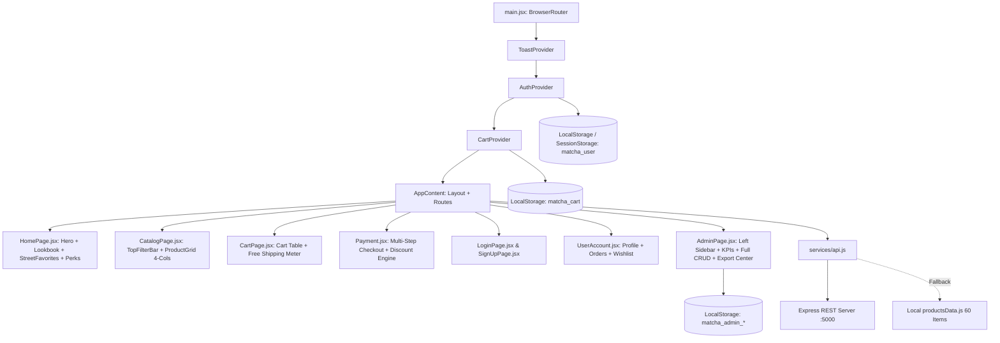

# MatchA Full-Stack Codebase Reference Manual (Alldata.md)

> **คู่มือรวบรวมตัวแปร, State, Context, Props, Data Models และโมดูลการทำงานหลักทุกหน้าของโปรเจกต์ MatchA**  
> สถาปัตยกรรม: React 18 (Vite) + React Context API + Tailwind CSS v4 + Express.js + Lenis Smooth Scroll + Lucide Icons

---

## 📌 สารบัญ (Table of Contents)
1. [สถาปัตยกรรมและ Data Flow รวม (System Overview)](#1-สถาปัตยกรรมและ-data-flow-รวม)
2. [Global Context Architecture (`CartContext`, `AuthContext`, `ToastContext`)](#2-global-context-architecture)
3. [Global Routing & Root (`App.jsx`)](#3-global-routing--root-appjsx)
4. [หน้าหลัก Landing Page (`HomePage.jsx` & Sub-Components)](#4-หน้าหลัก-landing-page-homepagejsx)
5. [หน้าแคตตาล็อกสินค้า (`CatalogPage.jsx` & `TopFilterBar.jsx`)](#5-หน้าแคตตาล็อกสินค้า-catalogpagejsx)
6. [คอมโพเนนต์การ์ดและป๊อปอัปสินค้า (`ProductCard.jsx` & `ProductModal.jsx`)](#6-คอมโพเนนต์การ์ดและป๊อปอัปสินค้า)
7. [หน้าตะกร้าสินค้า (`CartPage.jsx`)](#7-หน้าตะกร้าสินค้า-cartpagejsx)
8. [หน้าชำระเงิน & เช็คเอาต์ (`Payment.jsx` & Sub-Components)](#8-หน้าชำระเงิน--เช็คเอาต์-paymentjsx)
9. [หน้าระบบสมาชิก (`LoginPage.jsx` & `SignUpPage.jsx`)](#9-หน้าระบบสมาชิก-loginpagejsx--signuppagejsx)
10. [หน้าโปรไฟล์ผู้ใช้ (`UserAccount.jsx` & Modular Tabs)](#10-หน้าโปรไฟล์ผู้ใช้-useraccountjsx)
11. [หน้าผู้ดูแลระบบระดับสูง (`AdminPage.jsx` — Executive Dashboard)](#11-หน้าผู้ดูแลระบบระดับสูง-adminpagejsx)
12. [โครงสร้าง Layout & Navigation (`Navbar.jsx`, `Footer.jsx`, `Layout.jsx`)](#12-โครงสร้าง-layout--navigation)
13. [Service Layer, API Pipeline & Data Persistence](#13-service-layer-api-pipeline--data-persistence)

---

## 1. สถาปัตยกรรมและ Data Flow รวม

---

## 2. Global Context Architecture

### 2.1 `ToastContext.jsx` (`useToast()`)
* **หน้าที่:** แสดงผลป๊อปอัปแจ้งเตือน Toast สไตล์มินิมอลมุมขวาล่าง พร้อม Auto-Dismiss 3.5 วินาที
* **API:** `showToast(message, type = 'info' | 'success' | 'warning' | 'error')`, `hideToast()`

### 2.2 `CartContext.jsx` (`useCart()`)
* **หน้าที่:** จัดการ State ตะกร้าสินค้าและการคำนวณราคาทั้งหมด (ผูกกับ `localStorage: matcha_cart`)
* **State & Methods:**
  * `cartItems`: รายการสินค้าทั้งหมด
  * `getCartKey(item)`: สร้าง Unique Key `${id}-${size}-${color}` ป้องกันสินค้าทับกัน
  * `addToCart(product, quantity)`: เพิ่มสินค้าเข้าตะกร้าพร้อม Trigger แจ้งเตือน Toast
  * `updateQty(key, delta)`: ปรับจำนวนสินค้า (+1 / -1) พร้อมลบออกอัตโนมัติหากเหลือ 0
  * `removeItem(key)`: ลบสินค้าออกจากตะกร้า
  * `clearCart()`: ล้างตะกร้าหลังการชำระเงินสำเร็จ
  * `cartCount`: จำนวนชิ้นรวมทั้งหมด
  * `subtotal`: ยอดรวมราคาสินค้า
  * `shipping`: $0 เมื่อยอดถึง $100 หรือตะกร้าว่าง (นอกนั้น $10)
  * `total`: `subtotal + shipping`
  * `awayFromFreeShipping`: ยอดคงเหลือที่ต้องซื้อเพิ่มเพื่อให้ได้ส่งฟรี

### 2.3 `AuthContext.jsx` (`useAuth()`)
* **หน้าที่:** จัดการ Session ผู้ใช้งานและการเข้าสู่ระบบ
* **State & Methods:**
  * `currentUser`: Object ผู้ใช้ (`id`, `name`, `email`, `role`, `tier`)
  * `login(userData, rememberMe)`: เข้าสู่ระบบและบันทึก Storage
  * `logout()`: ล้างข้อมูลผู้ใช้และพากลับสู่หน้าหลัก
  * `updateProfile(updates)`: อัปเดตข้อมูลโปรไฟล์ผู้ใช้
  * `isAuthenticated`: `Boolean(currentUser)`
  * `isAdmin`: `currentUser?.role === 'Admin' || currentUser?.email === 'admin@matcha.com'`

---

## 3. Global Routing & Root (`App.jsx`)

* **Providers Wrapper:** `ToastProvider` $\to$ `AuthProvider` $\to$ `CartProvider` $\to$ `Layout`
* **Scroll Engine:** ติดตั้ง **Lenis Smooth Scroll** เพื่อประสบการณ์เลื่อนจอที่นุ่มนวล
* **Modal Orchestration:** ควบคุม `ProductModal.jsx` (Quick View) แบบ Global ดักฟังปุ่ม `Escape` และล็อกการเลื่อนของ `document.body`

---

## 4. หน้าหลัก Landing Page (`HomePage.jsx`)

| Component | รายละเอียดและการทำงาน |
| :--- | :--- |
| **`BrandHero`** | Cover 4-Slice Interactive Lookbook แบนเนอร์สลับภาพตาม Hover/Click |
| **`ChooseYourFit`** | โมเดลสตูดิโอ 2K ให้กดเลือกดู Silhouette ทรงเสื้อผ้า 6 สไตล์ |
| **`StreetFavorites`** | คารูเซลสินค้ายอดนิยม กรองหมวดหมู่จากฐานข้อมูลสินค้าครบทั้ง 60 ชิ้น พร้อมสลับเฉดสีเรียลไทม์ |
| **`BrandLoop`** | ตัววิ่ง Infinite Ticker สไตล์สตรีทแฟชั่นไฮเอนด์ |
| **`VdoSection`** | วิดีโอ Cinematic Motion พร้อมปุ่มกดรับโค้ดส่วนลด 15% (`MATCHA15`) |
| **`PulsePerks`** | การ์ด 3D Interactive แสดงจุดเด่น (Free Shipping, Eco Tea-dye, 14-day Exchange) |
| **`JoinDropList`** | ฟอร์มกรอกอีเมลรับสิทธิ์ Early VIP Drops |

---

## 5. หน้าแคตตาล็อกสินค้า (`CatalogPage.jsx`)

* **Top Horizontal Pill Filter Bar ([`TopFilterBar.jsx`](file:///c:/coding/MatchA/app/frontend/src/components/catalog/TopFilterBar.jsx)):**
  * **Season Dropdown:** All, Autumn, Spring, Summer, Winter, Artisan
  * **Color Swatches Popover:** ขยายกริด 3 คอลัมน์ มองเห็นครบ 13 เฉดสีในพริบตา ไม่ต้องเลื่อนจอ พร้อมระบบ Backdrop Click-Away
  * **Silhouette & Fit Dropdown:** All, Boxy Oversized, Relaxed, Wide Leg, Standard
  * **Price Range Slider:** สไลเดอร์ช่วงราคา $30 – $200
  * **In Stock Only Toggle:** สวิตช์กรองเฉพาะสินค้าที่มีสต็อก
* **Layout Grid:** ค่าเริ่มต้นแสดงผล **4 คอลัมน์** สำหรับเดสก์ท็อป, 3 บนแท็บเล็ต, 2 บนมือถือ และปุ่มสลับมุมมอง List View
* **Pagination & Skeleton:** แบ่งหน้าละ 12 ชิ้น พร้อม Loading Skeleton รองรับช่วงเปลี่ยนผ่าน

---

## 6. คอมโพเนนต์การ์ดและป๊อปอัปสินค้า

### 6.1 `ProductCard.jsx`
* **อัตราส่วนภาพ:** `aspect-4/5` พร้อม Padding ขอบใน ป้องกันภาพล้นหรือถูกตัดหัวตัดท้าย (`object-contain object-center`)
* **Hover Effect & Centered Quick View:** เมื่อเอาเมาส์ชี้ ภาพจะมืดลงอย่างนุ่มนวล (`bg-black/35 backdrop-blur-[1px]`) และปุ่ม **`QUICK VIEW`** จะลอยเด่นขึ้นมากึ่งกลางภาพ
* **Wishlist Auth Guard:** หากยังไม่ล็อกอิน เมื่อกดไอคอนหัวใจ ระบบจะขึ้น Toast แจ้งเตือน *"กรุณาเข้าสู่ระบบก่อนเพื่อบันทึกรายการสินค้าที่ชอบ"*

### 6.2 `ProductModal.jsx` (Quick View Modal)
* กรอบภาพขนาดใหญ่ทรง `aspect-4/5` พร้อมพื้นที่เว้นระยะรอบข้าง `p-4 sm:p-6`
* ควบคุมการซูมด้วย `group-hover:scale-102` อยู่ในกรอบ ไม่ล้นหน้าจอ
* ตัวเลือกปรับไซส์ (S, M, L, XL, XXL) และจำนวนสินค้าก่อนกด `ADD TO BAG`

---

## 7. หน้าตะกร้าสินค้า (`CartPage.jsx`)

* ตารางรายการสินค้าพร้อมรูปภาพ, สี, ไซส์, และปุ่มปรับจำนวน `+` / `-`
* แถบ **Free Shipping Progress Meter** แจ้งเตือนยอดที่ต้องซื้อเพิ่มเพื่อให้ได้ส่งฟรี
* สรุปยอด Subtotal, Shipping, Tax, Total พร้อมปุ่ม `PROCEED TO CHECKOUT`

---

## 8. หน้าชำระเงิน & เช็คเอาต์ (`Payment.jsx`)

* **Multi-Step Checkout Flow:**
  1. **Shipping Information:** ชื่อ, อีเมล, ที่อยู่, เบอร์โทร, ความเร็วขนส่ง
  2. **Payment Method:** บัตรเครดิต/เดบิต (Visa, Mastercard พร้อมระบบตรวจเลขบัตร), PromptPay QR, เก็บเงินปลายทาง (COD)
  3. **Order Summary Sidebar:** แสดงสรุปยอดและช่องใส่คูปองส่วนลด (`MATCHA15` ลด 15%, `FREESHIP` ส่งฟรี)
  4. **OrderSuccessModal:** ใบเสร็จคำสั่งซื้อพร้อมเคลียร์ตะกร้าอัตโนมัติ

---

## 9. หน้าระบบสมาชิก (`LoginPage.jsx` & `SignUpPage.jsx`)

* **Quick Demo Login:** ปุ่มล็อกอินด่วนสำหรับทดสอบระบบ (`Admin Demo`, `Member Demo`)
* **Client-Side Form Validation:** ตรวจสอบรูปแบบอีเมล, ความยาวรหัสผ่าน (ขั้นต่ำ 6 ตัวอักษร) พร้อม Error Badge ใต้ช่องกรอก

---

## 10. หน้าโปรไฟล์ผู้ใช้ (`UserAccount.jsx`)

โครงสร้างแยกแท็บย่อย (Modular Tab Architecture):
1. **`ProfileTab.jsx`:** แก้ไขชื่อ นามสกุล อีเมล เบอร์โทร
2. **`OrdersTab.jsx`:** ประวัติคำสั่งซื้อพร้อมสถานะ Tracking
3. **`FavoritesTab.jsx`:** รายการสินค้าใน Wishlist พร้อมปุ่มกดสั่งซื้อลงตะกร้า
4. **`AddressesTab.jsx`:** สมุดบันทึกที่อยู่จัดส่ง
5. **`PaymentMethodsTab.jsx`:** รายการบัตรชำระเงินที่บันทึกไว้
6. **`PreferencesTab.jsx`:** จัดการการแจ้งเตือน VIP และโปรโมชัน

---

## 11. หน้าผู้ดูแลระบบระดับสูง (`AdminPage.jsx` — Executive Dashboard)

* **🏛️ แถบเมนูด้านซ้าย (Left Navigation Sidebar):**
  * แสดงสถานะ Live Indicator, ข้อมูลผู้ปฏิบัติงาน และแถบเมนูพร้อม Badge แจ้งเตือน
* **📊 6 โมดูลบริหารจัดการหลัก:**
  1. **Overview & KPIs:** การ์ดสถิติ 4 ใบ (Gross Revenue, Orders, Stock Units, VIP Vault), กราฟแท่งยอดขายรายเดือนตลอดปี 2026, กราฟสัดส่วนยอดขายตามหมวดหมู่, และตารางคำสั่งซื้อล่าสุด
  2. **Inventory & Stock Management:** ตารางสต็อกสินค้า, ค้นหาแบบเรียลไทม์, ฟิลเตอร์หมวดหมู่/สถานะ, ปุ่มเติมสต็อกด่วน `+10`/`-5`, ปุ่มลบสินค้า, และปุ่ม `+ Add Garment` Modal
  3. **Orders Pipeline:** ตารางออเดอร์ลูกค้า, ฟิลเตอร์สถานะ (Processing, Shipped, Delivered), ดรอปดาวน์เปลี่ยนสถานะการจัดส่ง
  4. **Revenue Analytics:** วิเคราะห์ผลกำไร, อัตรา Conversion, และตารางเปรียบเทียบยอดขายกับเป้าหมายรายเดือน
  5. **VIP Customer Registry:** ทะเบียนสมาชิกระดับ VIP, ยอดใช้จ่ายสะสม, ปุ่ม Promote/Demote สมาชิก
  6. **Reports & Backups:** ดาวน์โหลด Full Store JSON Snapshot Backup และไฟล์ CSV (UTF-8 BOM สำหรับ Excel)

---

## 12. โครงสร้าง Layout & Navigation

* **`Navbar.jsx`:** โลโก้แบรนด์, แถบเมนูนำทาง, Mix & Match CTA, ตะกร้าสินค้าพร้อม Cart Count Badge และ Micro-animation
* **`Footer.jsx`:** ข้อมูลลิขสิทธิ์, ที่อยู่สตูดิโอ, ลิงก์นโยบาย และ Social Media Links
* **`Layout.jsx`:** Wrapper กลางที่คุม Navbar และ Footer ตลอดทั้งแอปพลิเคชัน

---

## 13. Service Layer, API Pipeline & Data Persistence

* **`services/api.js`:** ฟังก์ชัน `fetchWithFallback()` ทำงานคู่กับ Express Backend (`http://localhost:5000/api`) และสลับมาใช้ Local Dataset Fallback อัตโนมัติเมื่อ Backend ออฟไลน์
* **`utils/imageFallback.js`:** ฟังก์ชัน `handleImageError` ตรวจจับภาพเสียและใส่ภาพสำรองคุณภาพสูงทันที
* **LocalStorage Keys:**
  * `matcha_cart`: บันทึกข้อมูลตะกร้าสินค้า
  * `matcha_user`: บันทึกสถานะผู้ใช้งานที่ล็อกอิน
  * `matcha_admin_inventory`: บันทึกฐานข้อมูลสต็อกแอดมิน
  * `matcha_admin_orders`: บันทึกฐานข้อมูลคำสั่งซื้อแอดมิน
  * `matcha_admin_members`: บันทึกฐานข้อมูลสมาชิก VIP
