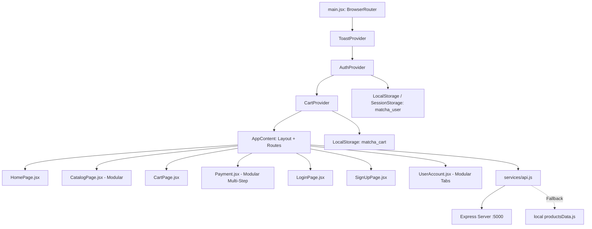

# MatchA Full-Stack Codebase Reference Manual (Alldata.md)

> **คู่มือรวบรวมตัวแปร, State, Context, Props และโมดูลการทำงานหลักทุกหน้าของโปรเจกต์ MatchA**  
> สถาปัตยกรรม: React 18 (Vite) + React Context API + Tailwind CSS v4 + Express.js + Lenis Smooth Scroll + Lucide Icons

---

## สารบัญ (Table of Contents)
1. [สถาปัตยกรรมและ Data Flow รวม (System Overview)](#1-สถาปัตยกรรมและ-data-flow-รวม)
2. [Global Context Architecture (`CartContext`, `AuthContext`, `ToastContext`)](#2-global-context-architecture)
3. [Global Routing & Root (`App.jsx`)](#3-global-routing--root-appjsx)
4. [หน้าหลัก Landing Page (`HomePage.jsx` & Sub-Components)](#4-หน้าหลัก-landing-page-homepagejsx)
5. [หน้าแคตตาล็อกสินค้า (`CatalogPage.jsx` & Sub-Components)](#5-หน้าแคตตาล็อกสินค้า-catalogpagejsx)
6. [หน้าตะกร้าสินค้า (`CartPage.jsx`)](#6-หน้าตะกร้าสินค้า-cartpagejsx)
7. [หน้าชำระเงิน & เช็คเอาต์ (`Payment.jsx` & Sub-Components)](#7-หน้าชำระเงิน--เช็คเอาต์-paymentjsx)
8. [หน้าระบบสมาชิก (`LoginPage.jsx` & `SignUpPage.jsx`)](#8-หน้าระบบสมาชิก-loginpagejsx--signuppagejsx)
9. [หน้าโปรไฟล์ผู้ใช้ (`UserAccount.jsx` & Tab Components)](#9-หน้าโปรไฟล์ผู้ใช้-useraccountjsx)
10. [โครงสร้าง Layout & Navigation (`Navbar.jsx`, `Footer.jsx`, `Layout.jsx`)](#10-โครงสร้าง-layout--navigation)
11. [Service Layer & API Pipeline (`api.js` & `server.js`)](#11-service-layer--api-pipeline)

---

## 1. สถาปัตยกรรมและ Data Flow รวม

---

## 2. Global Context Architecture

### 2.1 `ToastContext.jsx` (`useToast()`)
* **หน้าที่:** จัดการแสดงผลป๊อปอัปแจ้งเตือน Toast สีทอง/เขียวมัทฉะ ลอยขวาล่างอัตโนมัติ 3.5 วินาที
* **ฟังก์ชัน:** `showToast(message, type)`, `hideToast()`

### 2.2 `CartContext.jsx` (`useCart()`)
* **หน้าที่:** จัดการ State ตะกร้าสินค้าและการคำนวณราคาทั้งหมด (ผูกกับ `localStorage`)
* **ตัวแปรและฟังก์ชัน:**
  * `cartItems`: รายการสินค้าทั้งหมด
  * `addToCart(product, customQty)`: เพิ่มสินค้าพร้อมแสดง Toast
  * `updateQty(key, delta)`: ปรับจำนวนสินค้า
  * `removeItem(key)`: ลบสินค้าออกจากตะกร้า
  * `clearCart()`: เคลียร์ตะกร้าหลังสั่งซื้อสำเร็จ
  * `cartCount`: จำนวนชิ้นรวมในตะกร้า
  * `subtotal`: ยอดรวมราคาสินค้า
  * `shipping`: $0 เมื่อครบ $100 หรือตะกร้าว่าง นอกนั้น $10
  * `total`: `subtotal + shipping`
  * `awayFromFreeShipping`: ยอดที่ต้องซื้อเพิ่มเพื่อให้ได้ส่งฟรี

### 2.3 `AuthContext.jsx` (`useAuth()`)
* **หน้าที่:** จัดการ Session ผู้ใช้งานและการเข้าสู่ระบบ
* **ตัวแปรและฟังก์ชัน:**
  * `currentUser`: Object ผู้ใช้ (ชื่อ, อีเมล, role, badge)
  * `login(userData, rememberMe)`: เข้าสู่ระบบและบันทึก Storage
  * `logout()`: ออกจากระบบและล้าง Storage
  * `updateProfile(updates)`: อัปเดตข้อมูลส่วนตัว
  * `isAuthenticated`: `Boolean(currentUser)`

---

## 3. Global Routing & Root (`App.jsx`)

* ครอบด้วย Providers ทั้งหมด (`ToastProvider`, `AuthProvider`, `CartProvider`)
* ติดตั้ง Lenis Smooth Scroll และจัดการ Route Redirections
* เชื่อมโยง Modal สินค้า (`ProductModal.jsx`) พร้อมรองรับปุ่ม **`Escape`** และ Image Fallback

---

## 4. หน้าหลัก Landing Page (`HomePage.jsx`)

| Component | หน้าที่และฟีเจอร์เด่น |
| :--- | :--- |
| **`BrandHero`** | Cover 4-Slice Interactive Lookbook แบนเนอร์สลับภาพตามการคลิก/Hover |
| **`ChooseYourFit`** | โมเดลสตูดิโอ 2K ให้กดเลือกดู Silhouette ทรงเสื้อผ้า 6 สไตล์ |
| **`StreetFavorites`** | คารูเซลสินค้ายอดนิยม ปรับเปลี่ยนสีและกด Quick View ได้ |
| **`BrandLoop`** | ข้อความวิ่งอัตโนมัติ (Infinite Ticker) สไตล์สตรีทแฟชั่น |
| **`VdoSection`** | วิดีโอ Cinematic Motion พร้อมปุ่มกดรับโค้ดส่วนลด 15% (`MATCHA15`) |
| **`PulsePerks`** | การ์ด 3 มิติหมุนได้ แสดงสิทธิประโยชน์ของแบรนด์ (Free Shipping, Eco Tea-dye) |
| **`JoinDropList`** | ฟอร์มกรอกอีเมลรับข่าวสารและสิทธิ์ VIP Drops ก่อนใคร |

---

## 5. หน้าแคตตาล็อกสินค้า (`CatalogPage.jsx` & Sub-Components)

โครงสร้างแบบแยกส่วน (Modular Architecture):
1. **`CatalogToolbar.jsx`:** แถบค้นหา, เม็ด Category Pills, Dropdown เรียงลำดับ, และปุ่มสลับ Grid Layout (2, 3, 4, List)
2. **`CatalogFilterDrawer.jsx`:** เมนู Slide-out ด้านข้าง กรองตามฤดูกาล, สี, ทรง Silhouette, สไลเดอร์ราคา และสวิตช์ In Stock Only
3. **`CatalogPagination.jsx`:** ระบบแบ่งหน้าพร้อมตัวเลขและปุ่ม Prev/Next
4. **`ProductCardSkeleton.jsx`:** โครงกระพริบตอนโหลดสินค้า (Loading Skeleton)
5. **`EmptyState.jsx`:** การ์ดแจ้งเตือนเมื่อไม่พบสินค้า พร้อมปุ่ม "Reset All Filters"

---

## 6. หน้าตะกร้าสินค้า (`CartPage.jsx`)

* ดึงข้อมูลผ่าน `useCart()` คำนวณราคา, โปรโมชันส่งฟรี และสรุปยอดส่งต่อไปหน้า `/payment`

---

## 7. หน้าชำระเงิน & เช็คเอาต์ (`Payment.jsx` & Sub-Components)

โครงสร้างแบบ Multi-Step แยกเป็นโมดูล:
1. **`ShippingStep.jsx`:** ฟอร์มกรอกชื่อ-ที่อยู่จัดส่ง และเลือกความเร็วขนส่ง (Standard, Express, VIP Same-Day)
2. **`PaymentMethodStep.jsx`:** ตัวเลือกชำระเงิน (Visa, Mastercard, PromptPay QR, COD) พร้อมฟอร์มบัตรเครดิตและระบบตรวจสอบความถูกต้อง
3. **`OrderSummarySidebar.jsx`:** แถบสรุปยอดคำสั่งซื้อด้านขวา พร้อมช่องกรอกคูปองส่วนลด (`MATCHA15`, `FREESHIP`, `01`, `02`, `03`)
4. **`OrderSuccessModal.jsx`:** ป๊อปอัปใบเสร็จเมื่อชำระเงินสำเร็จ พร้อมเคลียร์ตะกร้าอัตโนมัติ

---

## 8. หน้าระบบสมาชิก (`LoginPage.jsx` & `SignUpPage.jsx`)

* **`LoginPage.jsx`:** รองรับปุ่ม Demo Account (`admin@matcha.vip`, `member@matcha.vip`)
* **`SignUpForm.jsx`:** ฟอร์มสมัครสมาชิกพร้อมการตรวจจับรหัสผ่าน, Error Badge ใต้ช่อง และแจ้งเตือน Toast เมื่อสมัครสำเร็จ

---

## 9. หน้าโปรไฟล์ผู้ใช้ (`UserAccount.jsx` & Tab Components)

โครงสร้างแยกแท็บย่อย (Modular Tabs):
1. **`ProfileTab.jsx`:** ฟอร์มแก้ไขชื่อ นามสกุล อีเมล เบอร์โทร
2. **`OrdersTab.jsx`:** ประวัติคำสั่งซื้อและสถานะจัดส่ง
3. **`FavoritesTab.jsx`:** รายการสินค้าที่บันทึกไว้ใน Wishlist พร้อมปุ่ม Quick Add to Cart
4. **`AddressesTab.jsx`:** สมุดที่อยู่จัดส่งพร้อม Badge ที่อยู่เริ่มต้น
5. **`PaymentMethodsTab.jsx`:** ข้อมูลบัตรเครดิตที่บันทึกไว้
6. **`PreferencesTab.jsx`:** สวิตช์เปิด-ปิดการแจ้งเตือน VIP และ SMS

---

## 10. โครงสร้าง Layout & Navigation

* **`Navbar.jsx`:** Cart Badge Pop Micro-animation, Navigation Links, ปุ่ม Login/Signup และ Avatar ผู้ใช้
* **`Footer.jsx`:** ข้อมูลแบรนด์, ที่อยู่, ช่องทางติดต่อ และนโยบายกฎหมาย
* **`Layout.jsx`:** Container หุ้มโครงสร้างทุกหน้า

---

## 11. Service Layer & API Pipeline

* **`services/api.js`:** ฟังก์ชัน `fetchWithFallback()` ทำงานคู่กับ Express Backend (`:5000`) และมี Local Dataset Fallback รองรับเมื่อเซิร์ฟเวอร์ออฟไลน์
* **`utils/imageFallback.js`:** ฟังก์ชัน `handleImageError` ป้องกันรูปแตกเมื่อ URL มีปัญหา
