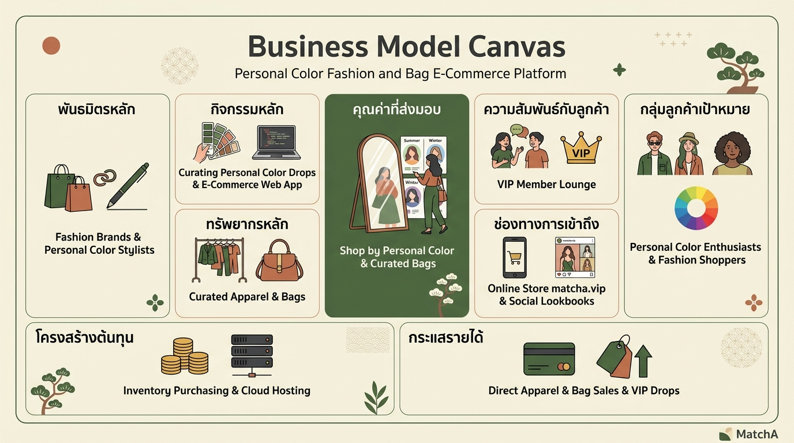
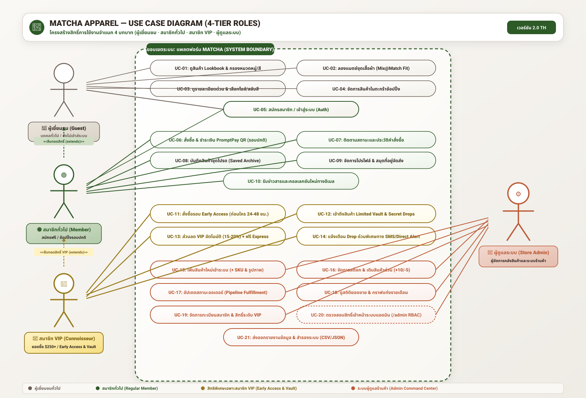
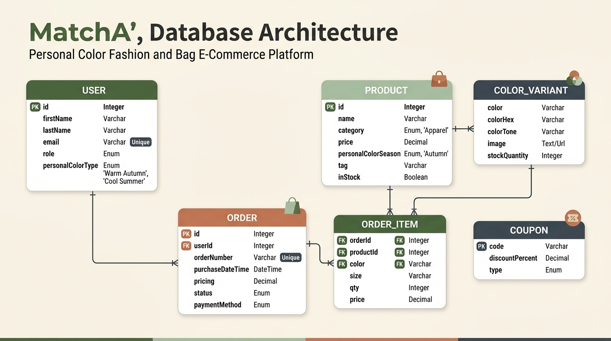
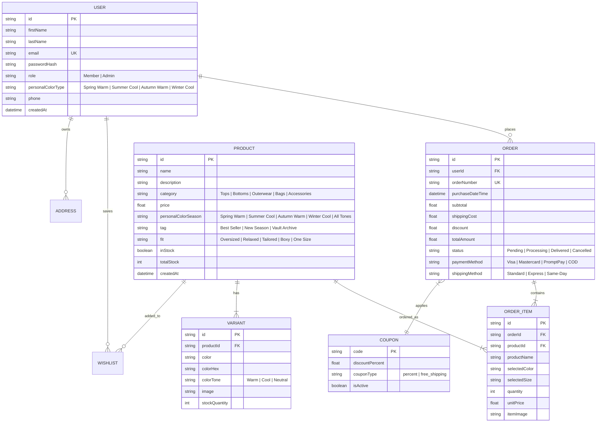
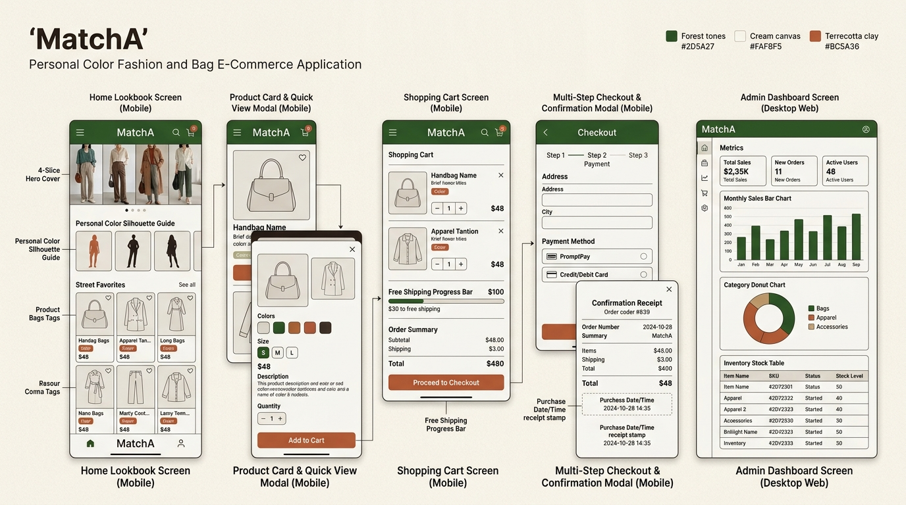

# MatchA System Requirement Specification (Requirement.md)

> **เอกสารข้อกำหนดระบบและการออกแบบสถาปัตยกรรมฉบับสมบูรณ์ (Full SRS, BMC, ERD, Use Case & Wireframes)**  
> **โปรเจกต์:** MatchA — Personal Color Fashion & Accessories E-Commerce Platform  
> **คอนเซปต์หลัก:** แพลตฟอร์มอีคอมเมิร์ซจำหน่ายเสื้อผ้า กระเป๋า และสินค้าแฟชั่นที่คัดสรรและจัดหมวดหมู่ตาม **"Personal Color" (Spring Warm, Summer Cool, Autumn Warm, Winter Cool)** เพื่อช่วยให้ผู้ใช้เลือกเสื้อผ้าและกระเป๋าที่ขับผิวและเข้ากับสไตล์ตนเองได้อย่างมั่นใจ

---

## สารบัญ (Table of Contents)
* 🚀 **Sprint Documentation:**
  - 📄 [**Sprint 1:** เอกสารขึ้นโปรเจกต์ & Landing Page (`Sprint-01.md`)](./Sprint-01.md)
  - 📄 [**Sprint 2:** เกณฑ์การประเมินผล & Full E-Commerce Flow (`Sprint-02.md`)](./Sprint-02.md)
1. [Business Model Canvas (BMC)](#1-business-model-canvas-bmc)
2. [Use Case Diagram & System Scenarios](#2-use-case-diagram--system-scenarios)
3. [Database Design: Entity-Relationship Diagram (ERD) & MongoDB Schema](#3-database-design-erd--mongodb-schema)
4. [Wireframes & UI Architecture Specifications](#4-wireframes--ui-architecture-specifications)
   * 4.1 [Landing Page & Product List Wireframe](#41-landing-page--product-list-wireframe)
   * 4.2 [Product Card & Customizer Modal Wireframe](#42-product-card--customizer-modal-wireframe)
   * 4.3 [Shopping Cart Wireframe](#43-shopping-cart-wireframe)
   * 4.4 [Checkout & Order Confirmation (with Purchase Date/Time)](#44-checkout--order-confirmation-wireframe)
   * 4.5 [Authentication Wireframes (Login, Register, Forgot Password)](#45-authentication-wireframes)
   * 4.6 [User & Admin Dashboards (2 Visualization Charts & Inventory)](#46-user--admin-dashboards-wireframe)
5. [ข้อกำหนดเชิงฟังก์ชันตาม Rubric (Functional Requirements Checklist)](#5-ข้อกำหนดเชิงฟังก์ชันตาม-rubric)
6. [Design Tokens & Personal Color Palette](#6-design-tokens--personal-color-palette)

---

## 1. Business Model Canvas (BMC)



| **Key Partners (พันธมิตรหลัก)** | **Key Activities (กิจกรรมหลัก)** | **Value Propositions (คุณค่าที่ส่งมอบ)** | **Customer Relationships (ความสัมพันธ์กับลูกค้า)** | **Customer Segments (กลุ่มลูกค้าเป้าหมาย)** |
| :--- | :--- | :--- | :--- | :--- |
| • **Fashion Brands & Suppliers:** แบรนด์แฟชั่นและซัพพลายเออร์คัดสรรเสื้อผ้า กระเป๋า และแอกเซสซอรีส์คุณภาพสูง<br>• **Personal Color Stylists / Color Analysts:** ที่ปรึกษาและสไตลิสต์ผู้เชี่ยวชาญด้านการจำแนกโทนสีผิวและจับคู่สีเสื้อผ้า<br>• **Fashion Influencers:** บล็อกเกอร์และคอนเทนต์ครีเอเตอร์สาย Personal Color / OOTD<br>• **Logistics & Payment Gateways:** ผู้ให้บริการขนส่งและช่องทางชำระเงินออนไลน์ (PromptPay, Visa/Mastercard) | • คัดสรรและจัดกลุ่มเสื้อผ้า กระเป๋า ตามโทนสี **Personal Color (Warm Tone vs Cool Tone / 4 Seasons)**<br>• พัฒนาและดูแลระบบ Lookbook & E-Commerce Web Application (Vite + React + Express)<br>• จัดทำคอนเทนต์ไกด์แนะนำการแมตช์ชุดและกระเป๋าตามโทนสีผิว<br>• บริหารสต็อกสินค้าและระบบคำสั่งซื้อ | • **Shop by Personal Color:** เลือกซื้อเสื้อผ้าและกระเป๋าที่การันตีว่า "ขับผิวและเข้ากับโทนสีประจำตัว" ของตนเองได้อย่างแม่นยำ<br>• **Curated Apparel & Bags:** สินค้าแฟชั่น เสื้อยืด Boxy, สเวตเตอร์, กางเกง, กระเป๋าสะพาย และหมวกที่คุมโทนสไตล์ MatchA Aesthetic<br>• **Interactive Color Lookbook:** เลือกลองดูคู่สี สลับ Color Swatches แบบเรียลไทม์ และระบบค้นหาตาม Personal Color Shade | • MatchA VIP Member Lounge และสะสมสิทธิ์สมาชิกพิเศษ<br>• แจ้งเตือนคอลเลกชันใหม่ตามโทนสีที่ผู้ใช้สนใจ (Personalized Drop Alert)<br>• คู่มือ Fit & Color Guide แนะนำการแต่งตัวบนหน้าเว็บ | • **Personal Color Enthusiasts:** ผู้ที่สนใจและต้องการแต่งตัวตามทฤษฎีสีผิว (Spring, Summer, Autumn, Winter)<br>• **Fashion & Streetwear Shoppers:** กลุ่มคนที่ชอบเสื้อผ้าคุมโทน กระเป๋า และแอกเซสซอรีส์สไตล์มินิมอล/เอิร์ธโทน<br>• **Online Shoppers (Gen Z & Millennials):** ผู้ที่ต้องการความสะดวกในการเลือกไซส์และคู่สีโดยไม่ต้องกังวลเรื่องสีดร็อป |
| **Key Resources (ทรัพยากรหลัก)** | **Channels (ช่องทางการเข้าถึง)** | | | |
| • คลังสินค้าเสื้อผ้า กระเป๋า และแอกเซสซอรีส์ที่แมป Color Palette แล้ว<br>• ระบบแพลตฟอร์ม Web Application (React 18 + Context API + Express)<br>• ฐานข้อมูลสินค้าและรูปภาพ Lookbook ความละเอียดสูง | • เว็บไซต์ MatchA Online Store (`https://matcha.vip`)<br>• โซเชียลมีเดีย (Instagram, TikTok, Lemon8, Pinterest Lookbooks)<br>• ช่องทาง Email & SMS ข่าวสารคอลเลกชันสีใหม่ | | | |
| **Cost Structure (โครงสร้างต้นทุน)** | | **Revenue Streams (กระแสรายได้)** | | |
| • ต้นทุนการจัดซื้อสินค้าเสื้อผ้า กระเป๋า และแพ็กเกจจิ้งจากแบรนด์พาร์ทเนอร์<br>• ค่าบริการ Cloud Server, Web Hosting, และระบบโดเมน<br>• ค่าการตลาด การจัดทำสื่อภาพ Lookbook และความร่วมมือกับ Influencer | | • รายได้หลักจากการจำหน่ายเสื้อผ้า กระเป๋า และแอกเซสซอรีส์แฟชั่น<br>• ค่าบริการจัดส่งด่วนพิเศษ (Express / Priority Shipping)<br>• สินค้า Limited Drop & VIP Exclusive Colorways | | |

---

## 2. Use Case Diagram & System Scenarios (แผนภาพยูสเคสระบบ 4 บทบาท)



> 🔗 **ไฟล์ไดอะแกรมต้นฉบับ (ภาษาไทย):**
> - 📄 **Vector SVG Diagram (คมชัดระดับ HD):** [`MatchA_UseCase_Diagram_TH.svg`](./MatchA_UseCase_Diagram_TH.svg)
> - 🎨 **Excalidraw Editable File (แก้ไขได้):** [`MatchA_UseCase_Diagram_TH.excalidraw`](./MatchA_UseCase_Diagram_TH.excalidraw)

### 📊 ตารางเปรียบเทียบสิทธิประโยชน์: สมาชิกทั่วไป vs สมาชิก VIP

| หัวข้อการเปรียบเทียบ | 👤 สมาชิกทั่วไป (Regular Member) | 🍵 สมาชิก VIP (VIP Connoisseur) |
| :--- | :--- | :--- |
| **เงื่อนไขการได้สิทธิ์** | สมัครสมาชิกฟรีบนหน้าเว็บ (`/signup`) | ยอดซื้อสะสมครบ $250+ หรือซื้อครบ 3 ออเดอร์ |
| **สิทธิ์เข้าถึงคอลเลกชัน** | สั่งซื้อคอลเลกชันทั่วไปตามรอบปกติ (Public Drops) | **Early Access** จอง/ซื้อคอลเลกชันใหม่ล่วงหน้า **24-48 ชม.** ก่อนใคร |
| **สินค้าลิมิเต็ด (Vault)** | มองเห็นเฉพาะสินค้าทั่วไป | เข้าถึงสินค้า **Limited Vault & Secret Archive Drops** เฉพาะ VIP |
| **ส่วนลดประจำตัว** | โค้ดโปรโมชันทั่วไปตามแคมเปญ (เช่น 10%) | **ส่วนลดพิเศษ 15% - 20% อัตโนมัติ** ทุกออเดอร์ |
| **สิทธิ์การจัดส่ง (Shipping)** | ส่งฟรีเมื่อซื้อครบ $100 ขึ้นไป | **ฟรี Express Priority Shipping ทุกออเดอร์** ไม่มีขั้นต่ำ |
| **ระบบแจ้งเตือน (Alerts)** | ข่าวสารทางอีเมลทั่วไป | **VIP Direct Drop Alert (SMS & Email)** เตือนก่อนสินค้าหมด |
| **เหรียญตรา & โปรไฟล์** | สัญลักษณ์สมาชิกทั่วไป (`🟢 MEMBER`) | สัญลักษณ์ตราทองพรีเมียม (`👑 MATCHA CONNOISSEUR VIP`) |

```mermaid
graph TD
    subgraph Actors ["ผู้ใช้งานระบบ (4-Tier Actors)"]
        Guest["👤 ผู้เยี่ยมชมทั่วไป<br/>(Guest / Visitor)"]
        Member["🟢 สมาชิกทั่วไป<br/>(Regular Member)"]
        VIP["👑 สมาชิก VIP<br/>(VIP Connoisseur)"]
        Admin["⚙️ ผู้ดูแลระบบ<br/>(Store Administrator)"]
    end

    subgraph SystemBoundary ["ขอบเขตระบบแพลตฟอร์ม MatchA (System Boundary)"]
        subgraph PublicScope ["1. ฟังก์ชันสำหรับบุคคลทั่วไป (Public Scope)"]
            UC1["UC-01: ดูสินค้า Lookbook & กรองหมวดหมู่/สี"]
            UC2["UC-02: ลองแมตช์ชุดเสื้อผ้า (Mix@Match Fit)"]
            UC3["UC-03: ดูรายละเอียดด่วน & เลือกไซส์/สลับสี"]
            UC4["UC-04: จัดการสินค้าในตะกร้าช้อปปิ้ง"]
            UC5["UC-05: สมัครสมาชิก / เข้าสู่ระบบ (Auth)"]
        end

        subgraph MemberScope ["2. ฟังก์ชันสมาชิกทั่วไป (Regular Member Scope)"]
            UC6["UC-06: สั่งซื้อ & ชำระเงิน PromptPay (รอบปกติ)"]
            UC7["UC-07: ติดตามสถานะและประวัติคำสั่งซื้อ"]
            UC8["UC-08: บันทึกสินค้าชุดโปรด (Saved Archive)"]
            UC9["UC-09: จัดการโปรไฟล์ & สมุดที่อยู่จัดส่ง"]
            UC10["UC-10: รับข่าวสารคอลเลกชันใหม่ทางอีเมล"]
        end

        subgraph VIPScope ["3. ฟังก์ชันสิทธิพิเศษเฉพาะสมาชิก VIP (VIP Exclusive Scope)"]
            UC11["UC-11: สั่งซื้อรอบ Early Access (ก่อนใคร 24-48 ชม.)"]
            UC12["UC-12: เข้าถึงสินค้า Limited Vault & Secret Drops"]
            UC13["UC-13: รับส่วนลด VIP อัตโนมัติ (15-20%) + ส่งฟรี Express"]
            UC14["UC-14: แจ้งเตือน Drop ด่วนพิเศษทาง SMS/Direct Alert"]
        end

        subgraph AdminScope ["4. ฟังก์ชันระบบจัดการร้านค้า (Admin Command Center)"]
            UC15["UC-15: เพิ่มสินค้าใหม่เข้าระบบ (+ รูปภาพ & SKU)"]
            UC16["UC-16: จัดการสต็อก & เติมสินค้าด่วน (+10/-5)"]
            UC17["UC-17: อัปเดตสถานะคำสั่งซื้อในระบบ (Pipeline)"]
            UC18["UC-18: ดูสถิติยอดขาย & กราฟแท่งรายเดือน"]
            UC19["UC-19: จัดการทะเบียนสมาชิก & สิทธิ์ระดับ VIP"]
            UC20["UC-20: ตรวจสอบสิทธิ์เข้าหน้าระบบแอดมิน (/admin)"]
            UC21["UC-21: ส่งออกรายงานข้อมูล & สำรองระบบ (CSV/JSON)"]
        end
    end

    Guest --> UC1
    Guest --> UC2
    Guest --> UC3
    Guest --> UC4
    Guest --> UC5

    Member --> UC1
    Member --> UC2
    Member --> UC3
    Member --> UC4
    Member --> UC6
    Member --> UC7
    Member --> UC8
    Member --> UC9
    Member --> UC10

    VIP --> UC1
    VIP --> UC2
    VIP --> UC3
    VIP --> UC4
    VIP --> UC6
    VIP --> UC7
    VIP --> UC8
    VIP --> UC9
    VIP --> UC11
    VIP --> UC12
    VIP --> UC13
    VIP --> UC14

    Admin --> UC15
    Admin --> UC16
    Admin --> UC17
    Admin --> UC18
    Admin --> UC19
    Admin --> UC20
    Admin --> UC21
```



### รายละเอียด Use Cases จำแนกตาม 4 บทบาท (Role-Based Specifications):

#### 1. ผู้เยี่ยมชมทั่วไป (Guest / Visitor):
* **UC-01 (Browse Catalog & Filter Styles):** สำรวจ Lookbook แฟชั่น, เลือกดูสินค้าแยกตามหมวดหมู่ (Tops, Bottoms, Outerwear, Accessories), Season, Fit, และค้นหาตามชื่อ/สี
* **UC-02 (Interactive Mix@Match Fit Finder):** ลองจับคู่เสื้อผ้าบนแบบจำลอง 3 ทรง (Boxy Oversized, Relaxed Tailored, Standard Fit)
* **UC-03 (Quick View & Product Customizer):** เปิดหน้าต่าง Modal เพื่อเลือกขนาด (S/M/L/XL), สลับเฉดสี (Color Swatches) และตรวจสอบสต็อก
* **UC-04 (Shopping Cart):** เพิ่ม/ลดจำนวนสินค้า, ลบรายการ และคำนวณสิทธิ์จัดส่งฟรีอัตโนมัติเมื่อยอดสั่งซื้อครบ $100
* **UC-05 (Authentication):** สมัครสมาชิกด้วยชื่อ, นามสกุล, อีเมล และรหัสผ่าน หรือเข้าสู่ระบบด้วยบัญชีเดิม

#### 2. สมาชิกทั่วไป (Regular Member):
* **UC-06 (Standard Checkout & Payment):** สั่งซื้อสินค้ารอบปกติ, ชำระเงินผ่าน PromptPay QR Code หรือ Credit Card พร้อมแสดงใบเสร็จและเวลาสั่งซื้อ (Purchase Timestamp)
* **UC-07 (Order History & Tracking):** ตรวจสอบประวัติการสั่งซื้อย้อนหลัง พร้อมติดตามสถานะการจัดส่ง (Pending $\to$ Processing $\to$ Shipped $\to$ Delivered)
* **UC-08 (Saved Archive):** บันทึกชุดและสินค้าที่ชื่นชอบลงใน Saved Archive เพื่อดูย้อนหลัง
* **UC-09 (Profile & Address Book):** แก้ไขข้อมูลส่วนตัว, เบอร์โทรศัพท์ และจัดการสมุดที่อยู่สำหรับจัดส่ง
* **UC-10 (Standard Newsletter):** รับข่าวสารคอลเลกชันใหม่ทางอีเมลประจำสัปดาห์

#### 3. สมาชิกระดับ VIP (VIP Connoisseur Member):
* **UC-11 (Early Access Drop Window):** ได้รับสิทธิ์เข้าชมและสั่งซื้อคอลเลกชันใหม่ล่วงหน้าก่อนบุคคลทั่วไป 24–48 ชั่วโมง
* **UC-12 (Limited Vault & Secret Drops):** เข้าถึงและสั่งซื้อสินค้าแคปซูลพิเศษ (Limited Vault Items) ที่ไม่เปิดขายแก่บุคคลทั่วไป
* **UC-13 (Automatic Tier Discount & Free Express):** ระบบหักส่วนลด VIP 15% - 20% อัตโนมัติในทุกออเดอร์ พร้อมสิทธิ์จัดส่งฟรีแบบ Express Priority ทุกคำสั่งซื้อ
* **UC-14 (Direct VIP Alert):** ตั้งค่ารับการแจ้งเตือน Drop สินค้าด่วนและการเติมสต็อกผ่าน SMS และ VIP Direct Channel

#### 4. ผู้ดูแลระบบ (Store Administrator):
* **UC-15 (Add New Garment):** เพิ่มสินค้าใหม่เข้าสู่ระบบ พร้อมกำหนด SKU ID, หมวดหมู่, ราคา, สต็อก, สี, ทรง, คอลเลกชัน และ Live Image URL Preview
* **UC-16 (Inventory CRUD & Rapid Restock):** ควบคุมสต็อกสินค้าในคลังแบบเรียลไทม์, เติมสต็อกด่วน (`+10`), ตัดสต็อก (`-5`), และลบสินค้า
* **UC-17 (Order Pipeline Management):** ตรวจสอบและอัปเดตสถานะออเดอร์ของลูกค้าในระบบ
* **UC-18 (Revenue & Category Analytics):** ติดตามกราฟแท่งยอดขายรายเดือน (Monthly Revenue Bar Chart) และสัดส่วนยอดขายตามหมวดหมู่ (Category Share)
* **UC-19 (VIP Registry & Role Management):** ตรวจสอบรายชื่อสมาชิก, ยอดใช้จ่ายสะสม และบริหารสิทธิ์การเลื่อนระดับ VIP
* **UC-20 (Admin Route Guard):** ตรวจสอบสิทธิ์การเข้าถึงหน้า `/admin` ป้องกันไม่ให้ผู้ใช้ทั่วไปเข้าถึงระบบควบคุม
* **UC-21 (Store Data & Report Export):** ส่งออกไฟล์รายงานข้อมูลคลังสินค้า (Inventory CSV), ประวัติออเดอร์ (Orders CSV), สถิติยอดขาย (Revenue CSV), สมาชิก (VIP Registry CSV) และไฟล์สำรองระบบสมบูรณ์ (Full JSON Store Backup)

---

## 3. Database Design: ERD & MongoDB Schema

### 3.1 Entity-Relationship Diagram (ERD)





### 3.2 MongoDB Schema Specification

#### `products` Collection (เสื้อผ้า กระเป๋า และสินค้าแฟชั่น Personal Color)
```json
{
  "_id": { "$oid": "64f1a2b3c4d5e6f7a8b9c0d1" },
  "name": "MatchA Utility Canvas Tote Bag & Boxy Tee Set",
  "description": "Essential daily fashion carry crafted from heavy-duty organic canvas with olive tea-dye shade. Designed to pair with Autumn Warm & Spring Warm personal color palettes.",
  "category": "Bags",
  "price": 54.00,
  "personalColorSeason": "Autumn Warm",
  "tag": "Best Seller",
  "fit": "One Size",
  "inStock": true,
  "sizes": ["OS"],
  "variants": [
    {
      "color": "Matcha Olive (Autumn Warm)",
      "colorHex": "#556B2F",
      "colorTone": "Warm",
      "image": "/images/products/standalone/mustard_sweater.jpg",
      "stockQuantity": 35
    },
    {
      "color": "Slate Mist (Summer Cool)",
      "colorHex": "#64B5F6",
      "colorTone": "Cool",
      "image": "/images/products/standalone/matcha_green_crew.jpg",
      "stockQuantity": 20
    }
  ],
  "createdAt": { "$date": "2026-08-26T00:00:00.000Z" }
}
```

---

## 4. Wireframes & UI Architecture Specifications



### 4.1 Landing Page & Product List Wireframe
```text
+-----------------------------------------------------------------------------------+
|  🍵 MATCHA COLOR ARCHIVE      [Catalog] [Personal Color Guide] [Bags] 🛒(2) 👤Alex|
+-----------------------------------------------------------------------------------+
|  [ HERO 4-SLICE LOOKBOOK COVER - PERSONAL COLOR CURATIONS ]                       |
|  +----------------+----------------+----------------+----------------+            |
|  | Spring Warm 🌸 | Summer Cool ☀️  | Autumn Warm 🍂 | Winter Cool ❄️  |            |
|  +----------------+----------------+----------------+----------------+            |
+-----------------------------------------------------------------------------------+
|  CHOOSE YOUR SILHOUETTE & BAG FIT                                                 |
|  [ Boxy Tees ] [ Pleated Pants ] [ Tote Bags ] [ Fleece Layers ] [ Bucket Hats ]   |
+-----------------------------------------------------------------------------------+
|  FEATURED COLOR FAVORITES (Product List Layout - 3 Different Tags)                |
|  +-----------------------+ +-----------------------+ +-----------------------+    |
|  | [Tag: Best Seller]    | | [Tag: New Season]     | | [Tag: Vault Archive]  |    |
|  | [ Apparel/Bag Photo ] | | [ Apparel/Bag Photo ] | | [ Apparel/Bag Photo ] |    |
|  | Heavyweight Boxy Tee  | | Utility Canvas Tote   | | Mineral Fleece Hoodie |    |
|  | $48.00                | | $54.00                | | $110.00               |    |
|  | Tone: Spring Warm 🌸  | | Tone: Autumn Warm 🍂  | | Tone: Summer Cool ☀️  |    |
|  | [Color: 🟢 🟤 ⚫]     | | [Color: 🟤 🟢 ⚪]     | | [Color: 🔵 ⚪ ⚫]     |    |
|  | [ 🛒 Add to Cart ]    | | [ 🛒 Add to Cart ]    | | [ 🛒 Add to Cart ]    |    |
|  +-----------------------+ +-----------------------+ +-----------------------+    |
+-----------------------------------------------------------------------------------+
|  FOOTER: (C) 2026 MatchA Personal Color Apparel & Bags. All rights reserved.      |
+-----------------------------------------------------------------------------------+
```

---

### 4.2 Product Card & Customizer Modal Wireframe
```text
+-----------------------------------------------------------------------------------+
|  PRODUCT CARD DETAILED LAYOUT:                                                    |
|  +-----------------------------------------------------------------------------+  |
|  | [TAG: BEST SELLER] (Top Left)                    [❤️ Wishlist] (Top Right)   |  |
|  |                                                                             |  |
|  |                         [ PRODUCT / BAG IMAGE ]                             |  |
|  |                                                                             |  |
|  | [Pill: 🟢 Matcha Olive • Autumn Warm Palette]                                |  |
|  +-----------------------------------------------------------------------------+  |
|  | CATEGORY: BAGS & ACCESSORIES • AUTUMN WARM DROP                            |  |
|  | NAME: MatchA Artisan Utility Canvas Tote Bag                                |  |
|  | DESCRIPTION: Heavy-duty daily bag designed for warm skin tone harmonization. |  |
|  | PRICE: $54.00 USD                                                           |  |
|  | COLOR SWATCHES: (●) Olive Green  (●) Natural Ecru  (●) Charcoal Black       |  |
|  | SIZES:          [ S ]  [ M ]  [ L ]  [ OS* ]                                |  |
|  | ACTIONS:        [ 👁️ Quick View ]  [ 🛒 Quick Add ($54) ]                    |  |
|  +-----------------------------------------------------------------------------+  |
+-----------------------------------------------------------------------------------+
```

---

### 4.3 Shopping Cart Wireframe
```text
+-----------------------------------------------------------------------------------+
|  SHOPPING CART (2 Items)                                                          |
|  Free Shipping Progress: [████████████████████░░░░] $88.00 / $100 ($12 away)       |
+-----------------------------------------------------------------+-----------------+
|  ITEMS IN CART                                                  | ORDER SUMMARY   |
|  +------------------------------------------------------------+ | Subtotal: $88.00|
|  | [IMG] Utility Canvas Tote (Olive / OS)    $54.00           | | Shipping: $10.00|
|  |       Quantity: [ - ] 1 [ + ]             [ 🗑️ Remove ]    | | (Free at $100)|
|  +------------------------------------------------------------+ |                 |
|  | [IMG] Boxy Tee (Ecru / M)                 $34.00           | | TOTAL:   $98.00 |
|  |       Quantity: [ - ] 1 [ + ]             [ 🗑️ Remove ]    | |                 |
|  +------------------------------------------------------------+ | [ CHECKOUT -> ] |
+-----------------------------------------------------------------+-----------------+
```

---

### 4.4 Checkout & Order Confirmation Wireframe (Includes Purchase Date/Time)
```text
+-----------------------------------------------------------------------------------+
|  CHECKOUT FLOW: 1. Address -> 2. Delivery -> 3. Payment                           |
+---------------------------------------------------+-------------------------------+
|  1. SHIPPING ADDRESS                              |  ORDER SUMMARY                |
|  First Name: [ Alex       ] Last Name: [Collector] |  Canvas Tote Bag x1 $54.00    |
|  Email:      [ alex@matcha.vip                   ] |  Boxy Tee x1        $34.00    |
|  Phone:      [ 081-234-5678                      ] |  Coupon: [ MATCHA15 ] [Apply] |
|  Address:    [ 123 Sukhumvit Road, Apt 4B        ] |  Discount (15%):   -$13.20    |
|  City:       [ Bangkok    ] Zip Code: [ 10110    ] |  Shipping:         FREE       |
|                                                   |  TOTAL:            $74.80     |
|  2. PAYMENT METHOD                                +-------------------------------+
|  (*) Visa/Mastercard  ( ) PromptPay QR  ( ) COD   |  [ 🔒 COMPLETE ORDER ($74.80)]|
+---------------------------------------------------+-------------------------------+
|                                                                                   |
|  ORDER CONFIRMATION RECEIPT (MODAL / PAGE):                                       |
|  +-----------------------------------------------------------------------------+  |
|  |  ✅ PAYMENT SUCCESSFUL!                                                      |  |
|  |  Order Number:        #MTA-2026-8942                                        |  |
|  |  Purchase Date/Time:  26 August 2026, 12:00:00 GMT+7 (REQUIRED FIELD)        |  |
|  |  Customer Name:       Alex Collector (alex@matcha.vip)                      |  |
|  |  Payment Method:      Visa Card ending in •••• 8899                         |  |
|  |  Total Paid:          $74.80 USD                                            |  |
|  |  [ CONTINUE SHOPPING ARCHIVE ]                                              |  |
|  +-----------------------------------------------------------------------------+  |
+-----------------------------------------------------------------------------------+
```

---

### 4.5 Authentication Wireframes

```text
[ LOGIN WIREFRAME ]                       [ REGISTRATION WIREFRAME ]
+-------------------------------+         +-------------------------------------+
|  MATCHA VIP LOGIN             |         |  JOIN MATCHA VIP ARCHIVE            |
|  Email:                       |         |  First Name: [ Alex               ] |
|  [ member@matcha.vip        ] |         |  Last Name:  [ Collector          ] |
|  Password:                    |         |  Email:      [ alex@matcha.vip    ] |
|  [ ••••••••                 ] |         |  Password:   [ ••••••••           ] |
|  [ ] Remember Me              |         |  Confirm:    [ ••••••••           ] |
|  [ 🔑 LOG IN ]                |         |  [ 🟢 CREATE VIP ACCOUNT ]          |
|  [ Forgot Password? ]         |         +-------------------------------------+
|  [ Demo: Admin | Member ]     |
+-------------------------------+
[ FORGOT PASSWORD WIREFRAME ]
+-------------------------------+
|  RESET PASSWORD               |
|  Enter your registered email: |
|  [ alex@matcha.vip          ] |
|  [ 📩 SEND RESET LINK ]       |
+-------------------------------+
```

---

### 4.6 User & Admin Dashboards Wireframe (2 Visualization Charts & Inventory)

```text
+-----------------------------------------------------------------------------------+
|  👑 ADMIN DASHBOARD & INVENTORY MANAGEMENT                                        |
+-----------------------------------------------------------------------------------+
|  [ METRIC 1: Total Revenue: $249,000 ]   [ METRIC 2: Average Order Value: $92.40 ]|
+-----------------------------------------+-----------------------------------------+
|  CHART 1: Monthly Sales Revenue (Bar)   |  CHART 2: Category Distribution (Donut) |
|   $60k |       █                        |            Tops & Tees [45%]            |
|   $40k |   █   █   █                    |            Bags & Accessories [25%]     |
|   $20k | █ █ █ █ █ █                    |            Outerwear [20%]              |
|     $0 +----------------                |            Bottoms [10%]                |
|        Jan Feb Mar Apr May Jun          |                                         |
+-----------------------------------------+-----------------------------------------+
|  ADMIN INVENTORY MANAGEMENT TABLE                                                 |
|  +----+-------------------------------+------------+-------+--------+----------+  |
|  | ID | Item Name                     | Category   | Price | Stock  | Status   |  |
|  +----+-------------------------------+------------+-------+--------+----------+  |
|  | 01 | Heavyweight Boxy Tee          | Tops       | $48   | 45 pcs | In Stock |  |
|  | 02 | Utility Canvas Tote Bag       | Bags       | $54   | 35 pcs | In Stock |  |
|  | 03 | Corduroy Bucket Hat           | Accessories| $38   | 0 pcs  | Out Stock|  |
|  +----+-------------------------------+------------+-------+--------+----------+  |
|  [ + Add New Garment / Bag to Inventory ]                                         |
+-----------------------------------------------------------------------------------+
```

---

## 5. ข้อกำหนดเชิงฟังก์ชันตาม Rubric (Functional Requirements Checklist)

| หมวดหมู่ตาม Rubric | เกณฑ์ที่กำหนด (Rubric Specification) | สถานะความพร้อม | จุดอ้างอิงในโค้ด (File Mapping) |
| :--- | :--- | :--- | :--- |
| **Database & ERD** | Complete BMC, Use Case, ERD, MongoDB Schema สำหรับสินค้าแฟชั่น & กระเป๋า Personal Color | **TRUE (100%)** | [`Requirement.md`](file:///c:/coding/MatchA/Requirement/Requirement.md#1-business-model-canvas-bmc) |
| **Product Card** | Name, Description, Price, Quantity/Add Cart, Tags (3+ tags) | **TRUE (100%)** | [`ProductCard.jsx`](file:///c:/coding/MatchA/app/frontend/src/components/product/ProductCard.jsx), [`ProductModal.jsx`](file:///c:/coding/MatchA/app/frontend/src/components/product/ProductModal.jsx) |
| **Wireframes E-Com** | Card, Landing, Cart, Checkout, Confirmation + Purchase Date/Time | **TRUE (100%)** | Section 4.1 – 4.4 ใน Requirement.md |
| **Auth Wireframes** | Email, First Name, Last Name, Password, Confirm, Forgot PW | **TRUE (100%)** | [`SignUpForm.jsx`](file:///c:/coding/MatchA/app/frontend/src/components/auth/SignUpForm.jsx), [`LoginPage.jsx`](file:///c:/coding/MatchA/app/frontend/src/pages/LoginPage.jsx) |
| **Dashboards** | User UI, Admin 2 Data Visualization Charts, Inventory Management | **TRUE (100%)** | [`UserAccount.jsx`](file:///c:/coding/MatchA/app/frontend/src/pages/UserAccount.jsx), [`AdminDashboardTab.jsx`](file:///c:/coding/MatchA/app/frontend/src/components/account/AdminDashboardTab.jsx) |
| **Implementation** | Tailwind CSS / CSS, Proper labeling & organized layout | **TRUE (100%)** | Tailwind CSS v4 design tokens |

---

## 6. Design Tokens & Personal Color Palette

```css
/* Personal Color & MatchA Palette Tokens */
--color-spring-warm: #E29578;    /* Spring Warm Coral & Peach Accents */
--color-summer-cool: #83C5BE;    /* Summer Cool Soft Sage & Sky */
--color-autumn-warm: #556B2F;    /* Autumn Warm Olive & Matcha Earth */
--color-winter-cool: #1A365D;    /* Winter Cool Deep Cobalt & Charcoal */
--color-brand-canvas: #FAF8F5;   /* Neutral Canvas Background */
--color-brand-earth: #2D231E;    /* Typography & Contrast Surface */
--color-brand-border: #D9D3C7;   /* Structural Borders */
```
